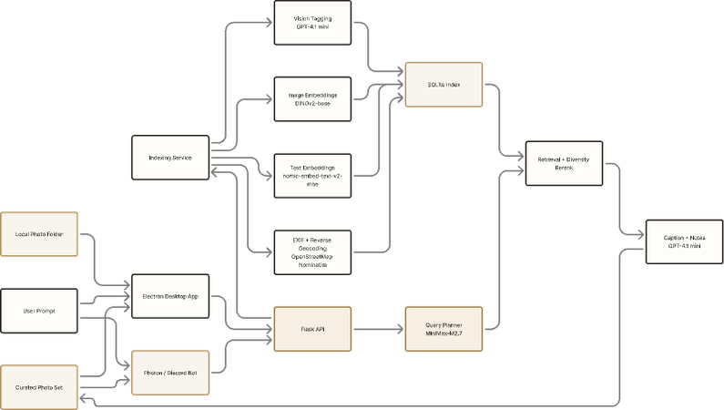

# MemoLens

MemoLens is a local photo agent for personal image libraries. It combines natural-language search, MiniMax-powered image understanding, lightweight semantic indexing, SQLite storage, and result copy generation into one workflow, so you can search your own photos with plain language, filter and curate candidate sets, and produce results that are easier to review or share.

This repository is not just an image browser. It is an experimental workspace built around the idea of local memory retrieval:

- Electron + React provide the desktop interface
- Flask exposes indexing and retrieval APIs
- The Python model layer handles MiniMax-first image understanding, semantic indexing, geo enrichment, and ranking
- `photon-bot/` reuses the same backend capabilities through Discord / iMessage entry points



Architecture diagram source: [MemoLens Architecture with Models](https://www.figma.com/board/vP1MAiLXXP29ymSYRK3cKl/MemoLens-Architecture-with-Models?node-id=0-1&t=gbEaNXfUiJ2Nmxy6-1)

## Project Goal

MemoLens is trying to solve more than “list my images.” The real goal is to make it easier to recall, filter, and organize personal photos in a more natural way.

Typical use cases include:

- Searching with plain language, such as “night scenes by the beach last winter” or “quieter everyday photos with fewer portraits”
- Indexing a local image folder into a searchable SQLite database
- Applying diversity reranking so one result set is not dominated by near-duplicate images
- Generating titles, captions, and highlights from the retrieved images
- Reusing the same retrieval stack from both the desktop app and chat-based interfaces

## Current Capabilities

- Local photo indexing: scan image folders and extract file metadata, dimensions, EXIF timestamps, and GPS data
- Image understanding: call MiniMax-first vision workflows to generate `description`, `tags`, and a conservative `location_hint`
- Geo enrichment: reverse geocode coordinates into `place_name` and `country`
- Semantic indexing: generate lightweight semantic vectors and store them in SQLite without requiring local `torch/transformers` installs
- Natural-language retrieval: rewrite user prompts into structured queries, then rank with time, location, tag, and text similarity signals
- Diversity reranking: suppress near-duplicates and improve variety inside the top candidate pool
- Copy generation: send retrieved images into a follow-up copywriting stage to produce title, body text, and highlights
- Multi-entry support: the same backend currently powers both the desktop app and `photon-bot`

When a public MiniMax image-understanding model is unavailable for the configured account, MemoLens automatically falls back to local metadata-derived descriptions and still keeps MiniMax text models in the loop for query planning and copy generation.

## Architecture Overview

The main workflow in this repository looks like this:

1. A local photo folder enters the indexing pipeline, which extracts EXIF data, optional geo metadata, visual descriptions, and lightweight semantic vectors.
2. Processed records are written into the SQLite `image_index` table, which acts as the retrieval foundation.
3. A natural-language user prompt is sent to the query planner and rewritten into a structured query.
4. The retrieval service ranks candidates using time, location, text similarity, and tag matching, then applies diversity reranking.
5. Final results can be returned to the Electron desktop UI or adapted into chat responses through `photon-bot`.
6. Retrieved images can then go through the copywriter step to generate titles, captions, and notes.

By default, the current `config.yaml` is set up to use:

- `MiniMax-VL-01` as the active vision profile
- `MiniMax-M2.7` as the active query profile
- `semantic_hash` as the default local semantic vector backend

These can all be changed through `config.yaml` or environment variables.

## Repository Structure

```text
backend/         Flask application entry and HTTP API
core/            Config, schemas, SQLite access, and shared text utilities
electron/        Electron main/preload layer and local indexing bridge
frontend/        Frontend-side query prototype and supplementary notes
indexing/        EXIF, image preprocessing, vision, embeddings, and geocoding pipeline
photon-bot/      Discord / iMessage integration layer
scripts/         Smoke tests and helper scripts
src/             Vite + React renderer and desktop UI
config.yaml      Library path, model profiles, and retrieval config
requirements.txt Python dependencies
package.json     Desktop frontend and Electron dependencies
```

If you want a practical reading order, start with:

- `backend/src/api/routes.py`
- `backend/src/__init__.py`
- `indexing/pipeline.py`
- `frontend/querying/retrieval.py`
- `src/App.tsx`
- `electron/main.ts`

## Quick Start

### 1. Prepare the Environment

Recommended environment:

- Python 3.9+
- Node.js 18+
- A local image folder that the app can access
- The model service or API keys required by the profiles in `config.yaml`

The current `config.yaml` defaults the image folder to `./local-photo-library`. For a real library, either point it at your own folder through environment variables or pick a folder in the Electron app:

```bash
export IMAGE_LIBRARY_DIR="/absolute/path/to/your/photos"
export SQLITE_DB_PATH="$IMAGE_LIBRARY_DIR/photo_index.db"
```

The default model path is MiniMax-first, so you will usually want:

```bash
export MINIMAX_KEY="your-key"
```

If you want to use Vertex AI on a Mac that already has `gcloud` authorization, MemoLens now supports Vertex provider profiles as well. The practical setup is:

```bash
export VISION_VLM_PROFILE=vertex_gemini25_flash
export QUERY_VLM_PROFILE=vertex_gemini25_flash
export VERTEX_PROJECT="your-gcp-project"
export VERTEX_LOCATION="us-central1"
```

When `VERTEX_ACCESS_TOKEN` is not set, the backend will try `gcloud auth application-default print-access-token` and then `gcloud auth print-access-token`.

If you want the desktop app to start in Vertex mode by default, put the same values in the repo-local `.env` file. `VERTEX_PROJECT` is optional when `gcloud config get-value project` already returns the project you want to use.

If you switch to another provider, supply the corresponding environment variables defined by the profile in `config.yaml`, such as `OPENAI_API_KEY`, `DASHSCOPE_API_KEY`, or any compatible service settings.

### 2. Install Python Dependencies

```bash
python3 -m venv .venv
source .venv/bin/activate
pip install -r requirements.txt
```

On macOS, you can also bootstrap the desktop app in one step:

```bash
npm run setup:mac
```

Or launch it directly from Finder / Terminal with:

```bash
./Launch\ MemoLens.command
```

You can also run a local deployment verification pass before opening the UI:

```bash
npm run verify:local
```

If you intentionally want to go back to legacy local CLIP / DINO backends, install the optional model dependencies too:

```bash
pip install -r requirements-local-models.txt
```

### 3. Install Desktop Dependencies

```bash
npm install
```

If you also want the chat integration, install dependencies there too:

```bash
cd photon-bot
npm install
cd ..
```

### 4. Start the Desktop App

```bash
npm run electron
```

The Electron shell now tries to auto-start the local Flask backend by using the Python interpreter saved in the desktop settings. The first thing you should do inside the app is open the `Control` section and confirm:

- backend URL
- Python command
- desktop default photo library
- desktop default SQLite path
- backend-managed photo library
- backend-managed SQLite path
- auto-start behavior

By default, managed app state now lives under:

```text
~/Library/Application Support/MemoLens
```

If you still want to run the backend manually, the command remains:

```bash
python3 backend/app.py
```

The backend listens on `http://127.0.0.1:5519` by default and exposes these core endpoints:

- `GET /healthz`
- `POST /v1/indexing/jobs`
- `POST /v1/retrieval/query`
- `GET /v1/library/files/<relative_path>`

The default bind host is loopback-only. If you intentionally need another bind address for a controlled environment, set:

```bash
export MEMOLENS_BACKEND_HOST="0.0.0.0"
```

Settings writes, local indexing, and direct library file serving are designed for trusted local use. The browser fallback is meant to come from `localhost` or the Electron shell, not from arbitrary remote origins.

If you want to work on the renderer separately:

```bash
npm run dev
ELECTRON_RENDERER_URL=http://127.0.0.1:5173 npx electron .
```

### 5. First Desktop Run

After the Electron window opens, the shortest path to a usable local workflow is:

1. Open the `Control` panel and confirm the backend is online.
2. Click `Choose folder` and select the local photo library you want to index.
3. If you want this folder to remain the default, copy the active library into the desktop or backend settings and save.
4. Click `Start indexing` and wait for the SQLite library to finish building. If MemoLens detects an older low-quality fallback index, this action will switch to `Rebuild index` automatically so the library can be refreshed with the active vision provider.
5. Go to `Compose`, describe the set you want, and MemoLens will return filtered photos plus a generated title and caption.

The folder picker is Electron-only. In plain browser mode, MemoLens can still render the UI, but it cannot scan a local directory or write the SQLite index for you.

If Electron is blocked on your machine, there is now a browser-and-backend fallback:

1. Start the backend with `python3 backend/app.py`
2. Start the frontend with `npm run dev`
3. Open the Vite URL in your browser
4. In `Control`, set `Backend photo library` and `Backend SQLite path`, then save
5. In `Library`, click `Start indexing` or `Rebuild index`

That fallback skips the native folder picker, but it still lets the backend read a local folder path, build the SQLite index, run retrieval, and generate captions with Vertex AI.

## Photon Bot

`photon-bot/` is the chat integration layer for MemoLens. It currently does three things:

- listen for Discord / iMessage messages
- call the existing Flask retrieval API
- return text replies and image attachments

See:

- [photon-bot/README.md](photon-bot/README.md)

Common verification command:

```bash
cd photon-bot
npm run doctor:discord
```

## Current State

This repository already has a runnable local-first prototype path, but it still clearly shows an in-progress architecture. It is best understood as a system that is being consolidated:

- `src/query/` already defines the intended frontend query boundary
- The active Python query stack still lives under `frontend/querying/` and should move into a backend-owned package in a later cleanup
- The default stack now assumes MiniMax for planning, image understanding, and copy generation, while semantic vectors are generated locally from MiniMax-produced descriptions and tags
- When the backend is unavailable, the UI can fall back to a local mock curation flow so interface work can continue
- The desktop shell now includes a visible control center for runtime settings and can auto-start the local Python backend
- The root README now documents the whole system rather than only the frontend submodule

If you continue developing this project, the next high-value cleanup is to further unify the local indexing boundary and the retrieval execution boundary, which are still split across Electron, local SQLite handling, and Python prototype code.
