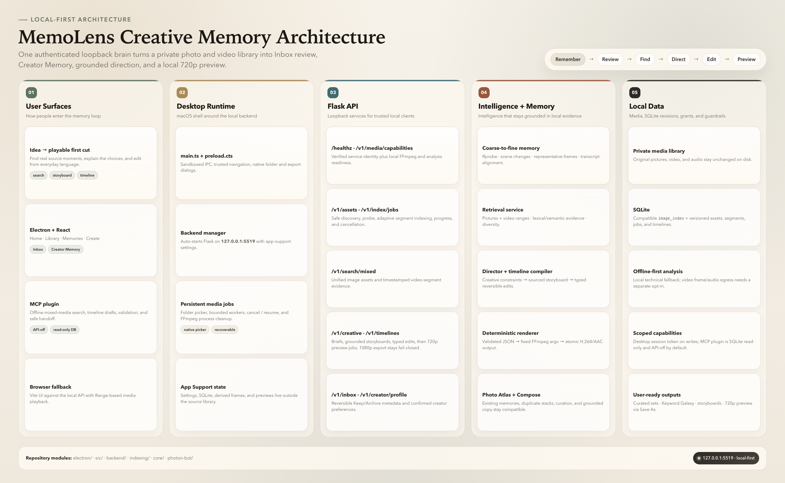

# MemoLens

**Local-first AI photo memory workbench.**

Turn a private photo folder into a searchable memory layer — index locally, search in natural language, curate diverse results, explore memories in Workbench, and reuse the same brain from Discord.

<p align="center">
  
</p>

<p align="center">
  <a href="#quick-start">Quick Start</a> ·
  <a href="#what-you-get">Features</a> ·
  <a href="#architecture">Architecture</a> ·
  <a href="#model-profiles">Models</a> ·
  <a href="#photon-bot">Photon Bot</a> ·
  <a href="#privacy">Privacy</a>
</p>

---

## Why MemoLens

People remember photos by scene, mood, place, and intent — not by filename or folder date. MemoLens keeps the library on your machine and adds a semantic layer on top:

| You want… | MemoLens does… |
| --- | --- |
| “Quiet mountain shots, no people, low repetition” | Plans the query, ranks with multi-signal retrieval, then diversity-reranks |
| A map of what your library *is about* | Builds Memory Workbench + Keyword Galaxy from the same SQLite index |
| Captions you can trust | Grounds titles / captions / highlights in retrieved evidence |
| Chat access to the same photos | Runs Discord through `photon-bot/` against the same Flask API |

Original photos and generated indexes stay local. Model calls get selected or summarized context — not a dump of your whole library.

---

## What You Get

- **Index** — scan a local folder; extract EXIF / GPS, vision descriptions & tags, quality scores, and lightweight semantic vectors into SQLite
- **Compose** — natural-language search with exclusions, quality-aware selection, and near-duplicate suppression
- **Workbench** — memories, Keyword Galaxy, storylines, duplicate stacks, baskets, cleanup cues, and feedback
- **AI Inspire** — fresh search prompts from sanitized library summaries
- **Browser-safe previews** — JPEG preview endpoints for camera formats (including HEIC when `pillow-heif` is installed)
- **Desktop shell** — Electron manages the local Flask backend, folder picking, and indexing progress
- **Photon Bot** — Discord bridge over the same retrieval API (iMessage helpers exist as experimental / doctor tooling)

When an external vision profile is unavailable, MemoLens can fall back to metadata-derived descriptions and keep query / copy flowing through the configured text profile.

Reverse geocoding is implemented but **off by default** (`geocode.enabled: false` / `ENABLE_REVERSE_GEOCODE=false`).

---

## Quick Start

### Requirements

- macOS recommended for the desktop app
- Python 3.9+
- Node.js 18+
- A local photo folder
- API keys or a local Ollama install for the profiles you enable

### Fastest path (macOS)

```bash
git clone https://github.com/bingjiezhu/MemoLens.git
cd MemoLens
cp .env.example .env   # add MINIMAX_KEY or switch profiles
npm run setup:mac
./Launch\ MemoLens.command
```

Or build and launch from Terminal:

```bash
npm run electron
```

### First run inside the app

1. Open **Control** and confirm the backend is online (`http://127.0.0.1:5519`).
2. Choose a photo folder → **Start indexing** / **Rebuild index**.
3. Open **Workbench** to build the Atlas memory layer and explore Keyword Galaxy.
4. Open **Compose**, try AI Inspire, or search: `9 mountain photos, no people, low repetition`.

Managed desktop state lives under:

```text
~/Library/Application Support/MemoLens
```

### Manual / browser fallback

```bash
python3 -m venv .venv
source .venv/bin/activate
pip install -r requirements.txt

npm install
python3 backend/app.py          # http://127.0.0.1:5519
npm run dev                     # http://127.0.0.1:5173
```

In **Control**, set backend photo library + SQLite paths, then index from **Library**. The browser path skips the native folder picker but still uses the same API.

Optional one-shot local stack:

```bash
npm run dev:local
```

Verify before you ship changes:

```bash
npm run verify:local
```

---

## Model Profiles

`config.yaml` ships separate **vision** and **query/copy** profiles. Defaults:

| Role | Default profile |
| --- | --- |
| Vision (indexing / grounding) | `minimax_vl01` |
| Query + copy | `minimax_m27` |
| Embeddings | `semantic_hash` (no local torch required) |

Supported families: MiniMax, Vertex / Gemini, OpenAI-compatible, DashScope, Ollama (including Gemma 4).

```bash
# MiniMax (config defaults)
export MINIMAX_KEY=...

# Vertex / Gemini
export VISION_VLM_PROFILE=vertex_gemini25_flash
export QUERY_VLM_PROFILE=vertex_gemini25_flash
export VERTEX_PROJECT="your-gcp-project"
export VERTEX_LOCATION="us-central1"

# Local Ollama
export VISION_VLM_PROFILE=ollama_gemma4_e4b
export QUERY_VLM_PROFILE=ollama_gemma4_e4b
```

When `VERTEX_ACCESS_TOKEN` is unset, the backend tries `gcloud auth application-default print-access-token`, then `gcloud auth print-access-token`.

Optional heavy local CLIP / DINO backends:

```bash
pip install -r requirements-local-models.txt
```

Point the library with env vars if you are not using the desktop picker:

```bash
export IMAGE_LIBRARY_DIR="/absolute/path/to/your/photos"
export SQLITE_DB_PATH="$IMAGE_LIBRARY_DIR/photo_index.db"
```

---

## Architecture

Five boundaries, one local loop:

| Layer | Code | Responsibility |
| --- | --- | --- |
| User surfaces | `src/App.tsx`, `src/AtlasView.tsx`, `photon-bot/` | Control, Library, Workbench, Compose, Discord |
| Desktop runtime | `electron/` | Folder picker, managed Flask, indexing progress, local previews |
| API services | `backend/src/api/routes.py` | Health, settings, indexing, retrieval, inspiration, Atlas, previews |
| AI + memory | `indexing/`, `frontend/querying/`, `core/photo_atlas.py` | Vision, vectors, planning, ranking, Atlas derivation |
| Data + models | `core/db.py`, `core/config.py`, `config.yaml` | SQLite, profiles, local-first guardrails |

```text
Index  →  Compose (retrieve + copy)  →  Workbench / Keyword Galaxy  →  AI Inspire
                              ↑
                     Flask :5519 (loopback)
                              ↑
              Electron  ·  Browser  ·  photon-bot
```

**Note:** active Python query engines still live under `frontend/querying/` for historical reasons; `backend/src/retrieval/` re-exports them. The React UI lives in repo-root `src/`.

### Repository map

```text
backend/       Flask entry + HTTP API
core/          Config, SQLite, Atlas, embeddings, LLM helpers
electron/      Desktop main / preload / backend manager
frontend/      Python query engines (legacy path; see frontend/README.md)
indexing/      Scan, EXIF, vision, geocode, vectors
photon-bot/    Discord messaging bridge
scripts/       Bootstrap, verify, backfill, smoke tests
src/           Vite + React renderer
config.yaml    Library defaults + model profiles
```

Suggested reading order: `backend/src/api/routes.py` → `indexing/pipeline.py` → `frontend/querying/retrieval.py` → `core/photo_atlas.py` → `src/App.tsx` / `src/AtlasView.tsx` → `electron/main.ts`.

---

## API Surface

Default bind: `http://127.0.0.1:5519` (loopback-only). Override with `MEMOLENS_BACKEND_HOST` / `MEMOLENS_BACKEND_PORT` only in trusted environments.

| Method | Path | Purpose |
| --- | --- | --- |
| `GET` | `/healthz` | Health, profiles, index stats |
| `GET` / `PUT` | `/v1/settings` | Persist library paths + active profiles |
| `POST` | `/v1/indexing/jobs` | Index / rebuild a local folder |
| `POST` | `/v1/retrieval/query` | Natural-language retrieval |
| `POST` | `/v1/retrieval/copy` | Grounded title / caption / highlights |
| `POST` | `/v1/inspiration/generate` | AI Inspire prompts |
| `GET` / `POST` | `/v1/atlas/*` | Status, rebuild, workbench, search, baskets, feedback, generate… |
| `GET` | `/v1/library/files/<path>` | Serve local originals (local clients) |
| `GET` | `/v1/library/previews/<path>` | Browser-safe JPEG previews |

Settings writes, indexing, and file serving are designed for **trusted local use**.

---

## Photon Bot

Discord bridge that calls the same Flask retrieval API and replies with text + images.

```bash
cd photon-bot
cp .env.example .env   # BACKEND_BASE_URL=http://127.0.0.1:5519
npm install
npm run doctor:discord
npm run dev
```

See [photon-bot/README.md](photon-bot/README.md). iMessage support is experimental (doctor / adapter present; Discord is the supported runtime entry).

---

## Quality Scores & Backfill

New indexes store an offline `aesthetic_score`. Upgrade an existing DB without re-running vision:

```bash
npm run quality:backfill -- --force
```

Import external LAION / NIMA-style scores:

```bash
npm run quality:backfill -- \
  --scorer external-json \
  --scores-json scores.json \
  --model-label laion-aesthetic
```

---

## Privacy

- Photos, SQLite DBs, `.env`, caches, and exports are gitignored
- Default `config.yaml` uses `./local-photo-library` as a placeholder only
- Inspiration / copy paths send structured summaries and selected facts — not raw libraries or absolute private paths
- Prefer Application Support (desktop) over writing state into the photo folder itself

---

## Development Status

Runnable local-first prototype with a complete desktop + Discord loop:

- Electron can manage Flask and desktop settings
- Indexing writes metadata, semantics, embeddings, and quality into SQLite
- Retrieval supports planning, negatives, semantic scoring, quality, and duplicate suppression
- Workbench derives Atlas assets from the same index
- Package boundary for query engines is mid-migration (`frontend/querying/` → eventual backend-owned package)

---

## License

No license file is published in this repository yet. All rights reserved by the author unless otherwise stated.
