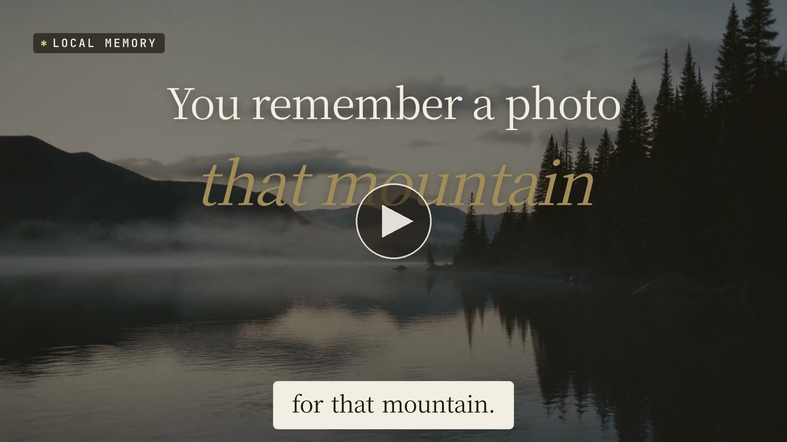
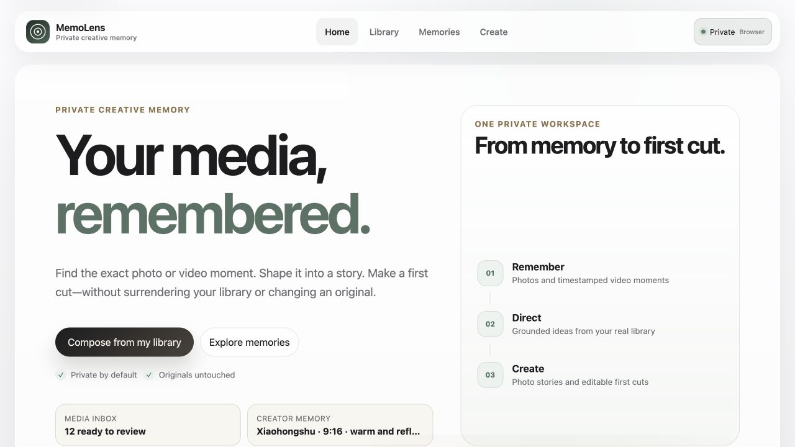
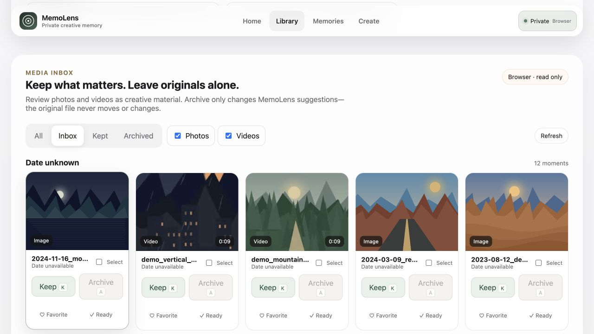
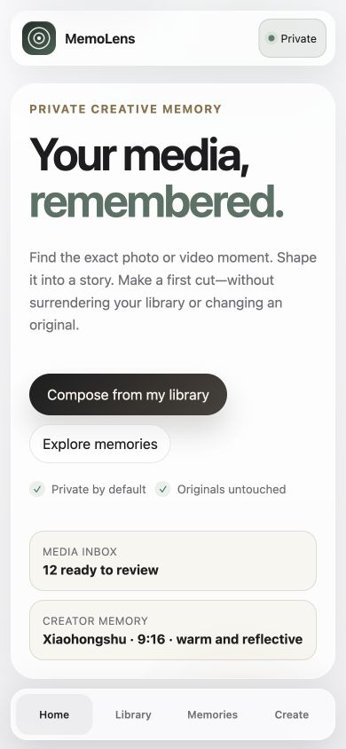
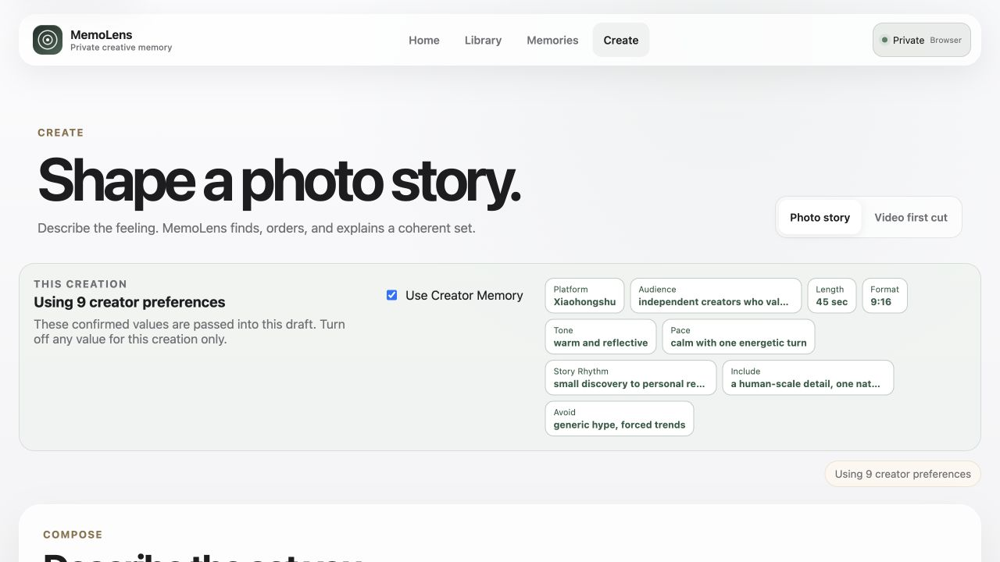
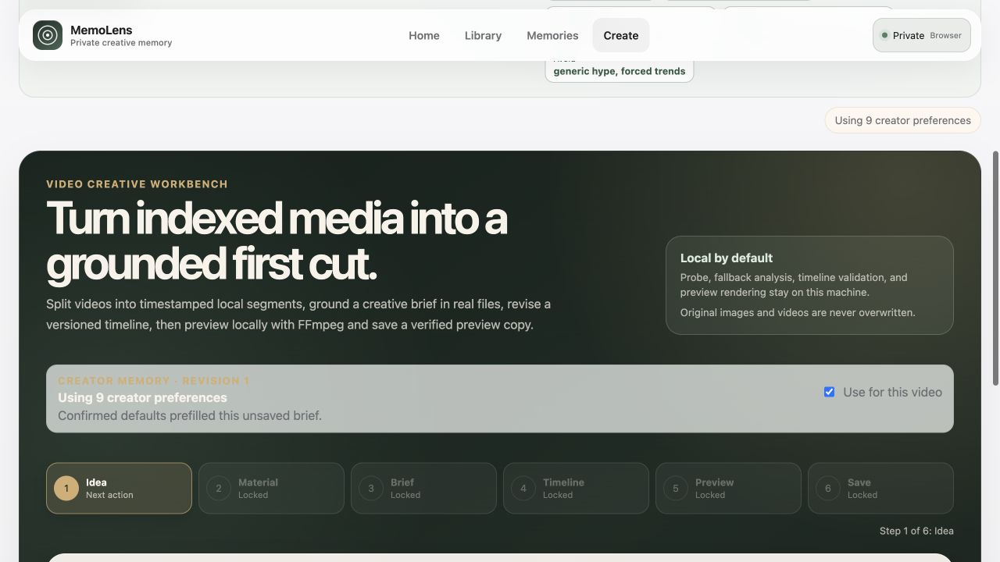
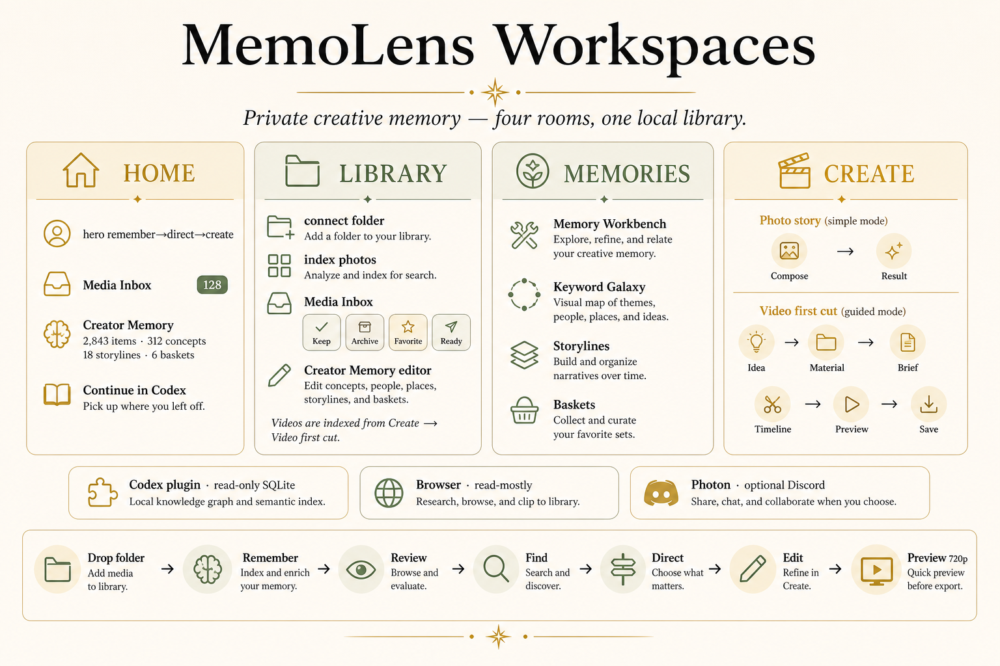

<p align="right"><strong>English</strong> · <a href="README.zh-CN.md">简体中文</a></p>

# MemoLens

**A private media home for creators — remembered locally, ready when you make the next post.**

Keep media in the folder you already use. MemoLens indexes **photos** on your machine and imports **videos** from Create → Video first cut. Inbox is for light review, not a cleanup chore; Create brings back source-grounded moments when you make the next post. Originals stay on disk. Preview export is a bounded **720p Save As** — never an overwrite of the source.

**License.** Source-available dual license: [non-commercial PolyForm Noncommercial 1.0.0](LICENSE) · [commercial use needs a separate grant](COMMERCIAL-LICENSE.md).

<p align="center">
  <a href="https://github.com/bingjiezhu/MemoLens/releases/download/promo/memolens-promo.mp4">
    
  </a>
</p>

<p align="center"><sub>50-second walkthrough (English captions, instrumental score, no voiceover). <a href="https://github.com/bingjiezhu/MemoLens/releases/download/promo/memolens-promo.mp4">Play MP4</a> · <a href="docs/assets/memolens-promo.mp4">download</a></sub></p>

<p align="center">
  <a href="#quick-start">Quick start</a> ·
  <a href="#what-you-get">Product</a> ·
  <a href="#architecture">Architecture</a> ·
  <a href="#privacy">Privacy</a> ·
  <a href="#license">License</a> ·
  <a href="CHANGELOG.md">Changelog</a>
</p>

<p align="center">
  
</p>

<p align="center">
  
  
</p>

<p align="center">
  
</p>

<p align="center">
  
</p>

---

## What you get

Four rooms, one local loop: **Home → Library → Memories → Create**.

| Room | What it is for |
| --- | --- |
| **Library** | Choose the folder you already use. Index **photos** here. Review new photos and videos in **Inbox** (Keep, Archive, Favorite, Ready, Undo). Confirm a small **Creator Memory** profile — unconfirmed guesses never become defaults. |
| **Memories** | Rediscover themes, Keyword Galaxy, duplicates, and baskets from the same SQLite index. |
| **Create** | Photo story, or **Video first cut**: idea → material → brief → timeline → 720p preview → Save As. **Videos are imported here**, not by Library photo indexing. |
| **Home** | A calm summary of Inbox and Creator Memory so the next action is obvious. |

Also included:

- Natural-language search with exclusions, quality-aware ranking, and near-duplicate suppression
- Typed, reversible hard-cut timeline edits (reorder, replace, trim, crop, fit)
- Local 720p H.264/AAC preview, then Electron Save As that never overwrites an existing destination
- Optional vision / query model profiles (MiniMax, Vertex/Gemini, OpenAI-compatible, DashScope, Ollama). No key required: metadata and semantic-hash fallbacks still run
- Optional [Photon](photon-bot/README.md) Discord bridge over the same local API (not an in-app chat)

**Current limits (honest):** video search is deterministic metadata and optional sidecar text, not full semantic video understanding. Final 1080p export stays fail-closed. Reverse geocoding is off by default.

---

## Quick start

**Needs:** macOS for the desktop app · Python 3.10+ (3.11 recommended) · Node.js 22.12+ · FFmpeg/ffprobe 6+

```bash
git clone https://github.com/bingjiezhu/MemoLens.git
cd MemoLens
cp .env.example .env          # optional: provider key or Ollama
npm run setup:mac             # venv, Node deps, Homebrew FFmpeg if missing
./Launch\ MemoLens.command
```

After setup you can also `npm run electron`.

**First run**

1. **Library** — pick your media folder and build the **photo** index.
2. **Create → Video first cut** — import MP4/MOV/M4V so they join the same library, then review everything in **Inbox**.
3. Confirm **Creator Memory** only for preferences you actually want reused.
4. **Memories** to rediscover, or **Create** for a photo story / video first cut.

Desktop state lives in `~/Library/Application Support/MemoLens`. Keep private libraries outside the git tree.

**Try the product without private media**

```bash
npm run demo:library          # 12 photos + 2 clips; gitignored
```

Then choose `./demo-photo-library` in the app.

**Browser fallback** (same API, no native folder picker):

```bash
python3 -m venv .venv && source .venv/bin/activate
pip install -r requirements.txt && npm install
python3 backend/app.py        # http://127.0.0.1:5519
npm run dev                   # http://127.0.0.1:5173
```

Set library paths in **Library → Advanced settings**. Photos index from Library; videos still enter through **Create → Video first cut**. One-shot stack: `npm run dev:local`.

**Developers:** `npm test` · `npm run verify:local` · [CONTRIBUTING.md](CONTRIBUTING.md)

---

## Model profiles

`config.yaml` separates **vision** (photo indexing) from **query/copy**. Defaults: `minimax_vl01` / `minimax_m27` / embeddings `semantic_hash` (no local torch).

```bash
export MINIMAX_KEY=...

export VISION_VLM_PROFILE=vertex_gemini25_flash
export QUERY_VLM_PROFILE=vertex_gemini25_flash
export VERTEX_PROJECT="your-gcp-project"

export VISION_VLM_PROFILE=ollama_gemma4_e4b
export QUERY_VLM_PROFILE=ollama_gemma4_e4b
```

If `VERTEX_ACCESS_TOKEN` is unset, the backend tries `gcloud` application-default then `gcloud auth print-access-token`. Optional CLIP/DINO: `pip install -r requirements-local-models.txt`.

Without the desktop picker:

```bash
export IMAGE_LIBRARY_DIR="/absolute/path/to/your/photos"
export SQLITE_DB_PATH="$IMAGE_LIBRARY_DIR/photo_index.db"
```

Existing indexes can refresh offline `aesthetic_score` with `npm run quality:backfill -- --force`.

---

## Architecture

<p align="center">
  
</p>

<p align="center">
  
</p>

<p align="center"><sub>Editable artboard: <code>docs/assets/memolens-architecture.html</code></sub></p>

```text
Remember  →  Review  →  Find  →  Direct  →  Edit  →  Preview
                              ↑
             authenticated Flask :5519 (loopback only)
                              ↑
                    Electron  ·  Browser
```

| Layer | Where | Role |
| --- | --- | --- |
| UI | `src/` | Home, Library, Memories, Create |
| Desktop | `electron/` | Folder / Save As pickers, Application Support SQLite, Flask supervisor, IPC |
| API | `backend/` | Loopback HTTP; photo index vs video import are separate routes |
| Intelligence | `indexing/`, `backend/src/retrieval/`, `backend/src/media/`, `core/` | Photo vision, mixed search, inbox, director, timeline, 720p render |
| Data | `core/db.py`, `core/media_db.py` | Image index + media schema v3; originals never overwritten |

Photo index: `POST /v1/indexing/jobs`. Video import: **Create → Video first cut** → `POST /v1/assets/import`. The React app is repo-root `src/`; `frontend/` is legacy Python shims, not the UI. Optional read-only MCP plugin: `.agents/` (desktop app does not need it).

```text
backend/     Flask API          electron/    desktop shell
core/        SQLite + config    src/         Vite + React UI
indexing/    photo pipeline     photon-bot/  Discord bridge
scripts/     setup + verify     docs/        specs + walkthrough assets
```

Design records: [Creator Memory spec](docs/specs/006-creator-memory-media-inbox.md) (shipped 0.5.0) · [Video spec](docs/specs/005-video-creative-workbench.md) (shipped 0.3.0; header still records the original proposal) · [product strategy](docs/product-strategy.md). Specs 005/006 are written in Chinese.

### Local API

Bind: `http://127.0.0.1:5519`. Do not tunnel this port. Writes need the desktop session token. Originless loopback reads (`curl`, Photon) are same-user tools, not a write grant.

| Method | Path | Purpose |
| --- | --- | --- |
| `GET` | `/healthz` | Identity, liveness, desktop challenge |
| `GET` / `PUT` | `/v1/settings` | Library paths and active profiles |
| `POST` | `/v1/indexing/jobs` | Photo folder index / rebuild |
| `POST` | `/v1/assets/import` | Discover and enqueue video analysis |
| `POST` | `/v1/search/mixed` | Photos + timestamped video segments |
| `GET` / `PUT` | `/v1/inbox/*` | Reversible review metadata |
| `GET` / `PUT` | `/v1/creator/profile*` | Versioned creator profile |
| `POST` | `/v1/retrieval/query` | Natural-language retrieval |
| `POST` | `/v1/retrieval/copy` | Grounded title / caption |
| `POST` / `GET` | `/v1/creative/*` · `/v1/timelines/*` | Briefs, revisions, validation |
| `POST` | `/v1/renders` | Hash-bound 720p preview job |
| `GET` | `/v1/library/previews/<path>` | Browser-safe JPEG (HEIC via `pillow-heif`) |

Full route list: `backend/src/api/routes.py`.

### Photon (Discord)

Optional. Same Flask retrieval API; not part of the desktop UI. Fails closed until a Discord user allowlist is set; guild messages also need a channel allowlist. Image replies **upload copies to Discord**.

```bash
cd photon-bot && cp .env.example .env && npm install && npm run doctor:discord && npm run dev
```

iMessage helpers are experimental. Details: [photon-bot/README.md](photon-bot/README.md).

---

## Privacy

- Indexes, caches, previews, and `.env` are gitignored. Default `./local-photo-library` is a placeholder only.
- **Photos:** an API vision profile receives a **resized working copy** after disclosure. Use Ollama or metadata fallback to keep pixels on-device.
- **Video:** probe, frames, audio, transcripts, timelines, and renders stay local. A photo-provider key never authorizes video egress.
- Reverse geocoding (Nominatim) is **off** (`ENABLE_REVERSE_GEOCODE=false`).
- Inspiration / copy send summaries and selected facts — not the library and not private absolute paths.
- Inbox / Creator Memory are versioned metadata. Archive does not move or delete files.
- Desktop API is loopback + per-launch token. Save As writes a new file and refuses to overwrite.

---

## License

Copyright © 2026 Bingjie Zhu. MemoLens is **source-available**, not [OSI Open Source](https://opensource.org/osd): the public grant does **not** allow commercial product, SaaS, or paid-service use.

| Use | Terms |
| --- | --- |
| Personal research, learning, hobby, education / public research | [PolyForm Noncommercial 1.0.0](LICENSE) |
| Company product, internal production, SaaS, paid distribution | [Separate commercial license](COMMERCIAL-LICENSE.md) — contact [Bingjie Zhu](https://github.com/bingjiezhu) |

FFmpeg is an external runtime: [THIRD_PARTY_NOTICES.md](THIRD_PARTY_NOTICES.md). Contributions: [CONTRIBUTING.md](CONTRIBUTING.md). Security: [SECURITY.md](SECURITY.md).
