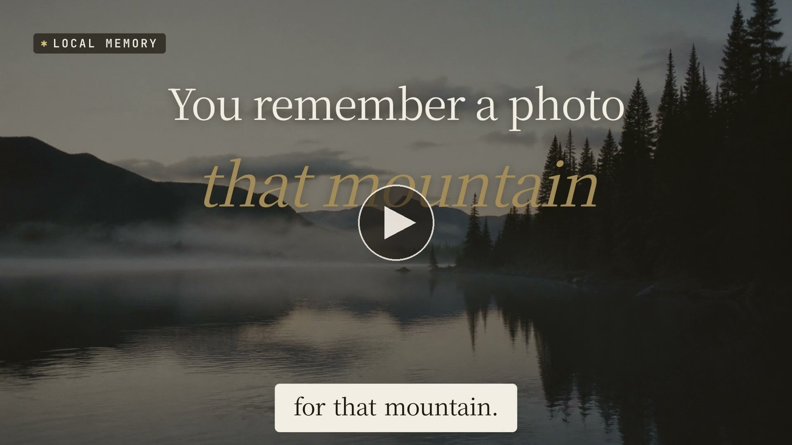
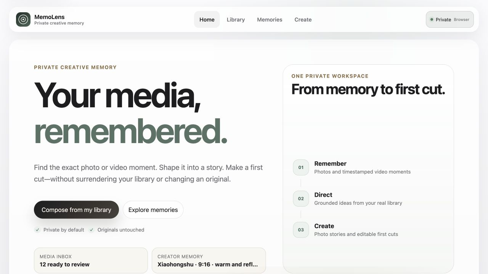
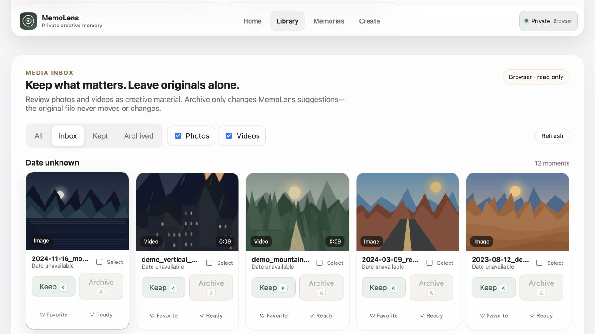
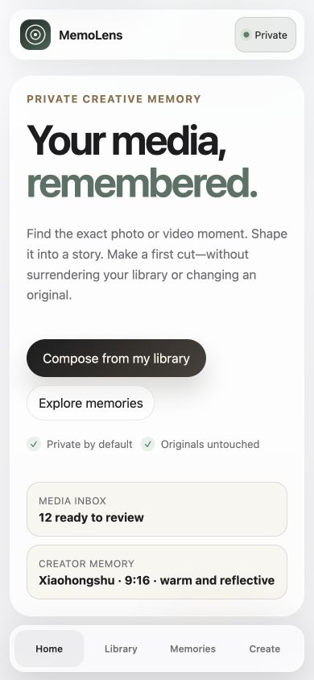
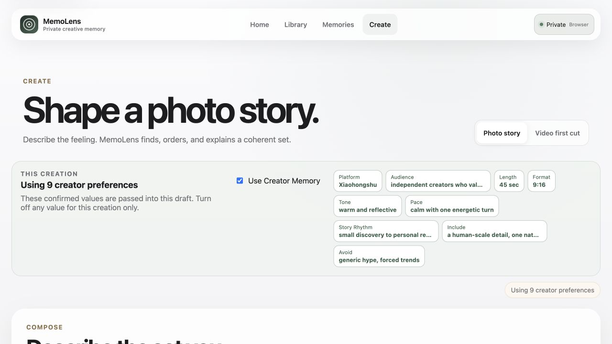
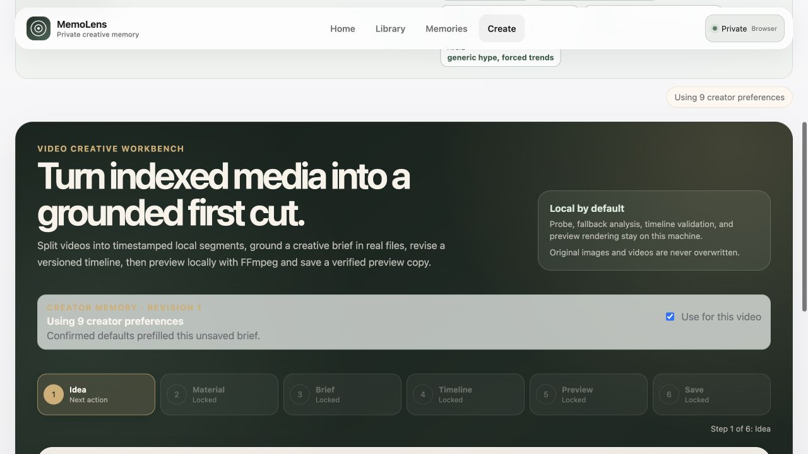
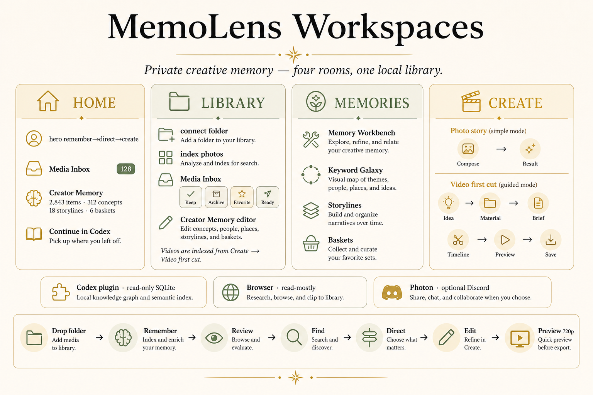
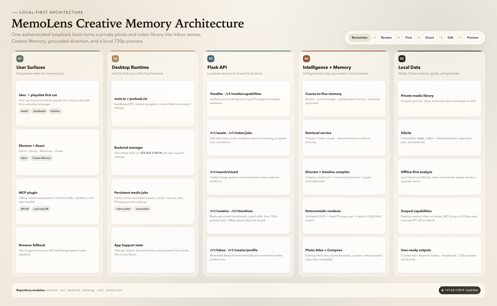

<p align="right"><strong>English</strong> · <a href="README.zh-CN.md">简体中文</a></p>

# MemoLens

**A private media home for creators — remembered locally, ready when you make the next post.**

Keep photos and videos in the folder you already use. Discuss a project in **Codex or DeepSeek Harness**, then refine its saved Timeline in the shared Browser editor. The local companion owns folder approval, background scanning, pairing and export; it is not a second AI chat. Originals stay untouched, and Save creates a new project revision.

**Development preview:** local scanning, grounded first cuts, reversible editing and **silent 1080p hard-cut packages** are implemented. Audio mixing, captions, transitions and a complete one-prompt finished-film workflow are not. Start with the [supported workflow and troubleshooting](docs/user-guide.md); see [release validation and remaining limits](docs/releases/2026-10-02-readiness.md).

**License.** Source-available dual license: [non-commercial PolyForm Noncommercial 1.0.0](LICENSE) · [commercial use needs a separate grant](COMMERCIAL-LICENSE.md).

<p align="center">
  <a href="https://github.com/bingjiezhu/MemoLens/releases/download/promo/memolens-promo.mp4">
    
  </a>
</p>

<p align="center"><sub>Historical 0.5 desktop walkthrough; not a demonstration of the current plugin workflow. <a href="https://github.com/bingjiezhu/MemoLens/releases/download/promo/memolens-promo.mp4">Play MP4</a> · <a href="docs/assets/memolens-promo.mp4">download</a></sub></p>

<p align="center">
  <a href="#quick-start">Quick start</a> ·
  <a href="#what-you-get">Product</a> ·
  <a href="#architecture">Architecture</a> ·
  <a href="#privacy">Privacy</a> ·
  <a href="#license">License</a> ·
  <a href="CHANGELOG.md">Changelog</a>
</p>

<p align="center">
  
</p>

<p align="center">
  
  
</p>

<p align="center">
  
</p>

<p align="center">
  
</p>

---

## What you get

One shared project across the agent, Browser editor and native companion. The screenshots above show the retained 0.5 desktop design.

| Room | What it is for |
| --- | --- |
| **Library** | Native folder approval; plugin bootstrap creates a resumable mixed-media scan. Inbox review and confirmed Creator Memory remain local and reversible. |
| **Memories** | Rediscover themes, Keyword Galaxy, duplicates, and baskets from the same SQLite index. |
| **Create** | Open an existing project by its exact ID; inspect Blueprint, build Coverage and Timeline, and request native export. The older brief/720p-preview workflow remains separate. |
| **Browser editor** | Select, seek, trim, reorder, replace, split, remove, Save/Discard and inspect/restore Timeline history under project-specific pairing. |
| **Home** | A calm summary of Inbox and Creator Memory so the next action is obvious. |

Also included:

- Natural-language search with exclusions, quality-aware ranking, and near-duplicate suppression
- Canonical Timeline edits share the same project state across Codex and DeepSeek; the separate Unsaved Draft Lab never saves a project
- Canonical export creates video, script, manifest and an exact usage list; it never overwrites original media or an existing package
- Optional vision / query model profiles (MiniMax, Vertex/Gemini, OpenAI-compatible, DashScope, Ollama). No key required: metadata and semantic-hash fallbacks still run
- Optional [Photon](photon-bot/README.md) Discord bridge over the same local API (not an in-app chat)

**Current limits:** metadata/semantic-hash fallback is not visual understanding. Browser source playback is muted; canonical 1080p export is silent. The old 720p preview is a separate compatibility path. Full audio/caption/transition editing, portable editable project bundles and real-model cross-host acceptance remain unfinished. Reverse geocoding is off by default.

---

## Quick start

**Needs:** macOS for the desktop companion · Node.js 22.12+ · FFmpeg/ffprobe 6+. Setup manages Python 3.14 for Core; its actual linked SQLite must pass the bundled WAL-safety check. The standalone plugin supports Python 3.10+. DeepSeek Harness additionally requires Node.js 22.19+ or 24+.

```bash
git clone https://github.com/bingjiezhu/MemoLens.git
cd MemoLens
cp .env.example .env          # optional: provider key or Ollama
npm run setup:mac             # venv, Node deps, Homebrew FFmpeg if missing
./Launch\ MemoLens.command
```

After setup you can also `npm run electron`.

### Install the agent plugin

From this repository, with Codex CLI installed:

```bash
codex plugin marketplace add "$(pwd)"
codex plugin add memolens@memolens-local
```

Start a new Codex task and ask MemoLens to set up your Library. When prompted, open the native companion and choose the folder there. Leave it running for scanning, pairing and editing. To install in DeepSeek Harness Web:

```bash
dsh plugin --profile web add "$(pwd)/.agents/plugins/plugins/memolens"
dsh --profile web --dump-config
dsh --profile web
```

DeepSeek support is a developer-preview adapter, not a guarantee for every Harness version. See [host setup and exact compatibility](.agents/plugins/plugins/memolens/deepseek-harness/README.md).

### First project

1. Ask the agent for Library scan status and an exact project ID. A completed scan is not yet a creative proposal or an editable Timeline.
2. Prepare a source-grounded Blueprint with the agent and approve only the necessary project operations in the native pairing dialog.
3. In **Create → Video first cut → Open existing project**, enter that ID. Inspect the proposal, materialize Coverage and the first cut; missing evidence remains a gap, not an invented clip.
4. Ask the agent to open that project in the **MemoLens Canonical Editor**. Save writes a new revision; Discard does not. Export remains in the native project workspace and is currently silent.

The detailed [user guide](docs/user-guide.md) covers expired pairing, missing evidence and recovery. The plugin does not require a separate MemoLens model key; automatic vision analysis is a distinct optional provider capability.

**Optional existing desktop workflow**

1. **Library** — pick your media folder and build the **photo** index.
2. **Create → Video first cut** — import MP4/MOV/M4V so they join the same library, then review everything in **Inbox**.
3. Confirm **Creator Memory** only for preferences you actually want reused.
4. **Memories** to rediscover, or **Create** for a photo story / video first cut.

Desktop state lives in `~/Library/Application Support/MemoLens`. Keep private libraries outside the git tree.

**Try the product without private media**

```bash
npm run demo:library          # 12 photos + 2 clips; gitignored
```

Then choose `./demo-photo-library` in the app.

**Browser development mode** (not a replacement for native folder or export authority):

```bash
npm run setup:mac
bash scripts/run_python.sh backend/app.py  # http://127.0.0.1:5519
npm run dev                   # http://127.0.0.1:5173
```

Use a disposable app-state and preconfigured test Library for diagnostics. Normal Library selection belongs to the native picker, not an arbitrary browser path. One-shot development stack: `npm run dev:local`.

**Developers:** `npm test` · `npm run verify:local` · [CONTRIBUTING.md](CONTRIBUTING.md)

---

## Model profiles

`config.yaml` separates **vision** (photo indexing) from **query/copy**. Defaults: `minimax_vl01` / `minimax_m27` / embeddings `semantic_hash` (no local torch).

```bash
export MINIMAX_KEY=...

export VISION_VLM_PROFILE=vertex_gemini25_flash
export QUERY_VLM_PROFILE=vertex_gemini25_flash
export VERTEX_PROJECT="your-gcp-project"

export VISION_VLM_PROFILE=ollama_gemma4_e4b
export QUERY_VLM_PROFILE=ollama_gemma4_e4b
```

If `VERTEX_ACCESS_TOKEN` is unset, the backend tries `gcloud` application-default then `gcloud auth print-access-token`. Optional CLIP/DINO: `pip install -r requirements-local-models.txt`.

For explicitly isolated headless development only:

```bash
export IMAGE_LIBRARY_DIR="/absolute/path/to/your/photos"
export SQLITE_DB_PATH="/absolute/path/to/disposable-state/photo_index.db"
```

Use the managed app indexing/rebuild workflow for current libraries. Legacy direct-backfill scripts reject managed databases and are not a supported way to change canonical analysis.

---

## Architecture

<p align="center">
  
</p>

<p align="center">
  
</p>

<p align="center"><sub>Historical desktop architecture artboard. Current ownership and project flow are described below.</sub></p>

```text
Library → evidence → Blueprint → Coverage → Timeline → silent export → Usage
                              ↑                   ↑
                    Codex / DeepSeek       shared Browser editor
                              └──── one local Core ────┘
                        native companion: permissions and runtime
```

| Layer | Where | Role |
| --- | --- | --- |
| UI | `src/` | Home, Library, Memories, Create |
| Desktop | `electron/` | Folder / Save As pickers, Application Support SQLite, Flask supervisor, IPC |
| API | `backend/` | Loopback HTTP; photo index vs video import are separate routes |
| Intelligence | `indexing/`, `backend/src/retrieval/`, `backend/src/media/`, `core/` | Photo vision, mixed search, inbox, director, timeline, 720p render |
| Data | `core/db.py`, `core/media_db.py` | Managed image/media schema v20, immutable revisions and export usage; originals never overwritten |
| Agent adapter | `.agents/plugins/plugins/memolens/` | Shared read-only data tools, independently paired writes and a project-bound Browser editor |

The React companion is repo-root `src/`; `frontend/` is legacy Python compatibility code, not the UI. Agent and Browser surfaces share Core contracts; neither gains native folder, export or publication authority from ordinary read access. See the [spec index](docs/specs/README.md) for implementation and remaining work.

```text
backend/     Flask API          electron/    desktop shell
core/        SQLite + config    src/         Vite + React UI
indexing/    photo pipeline     photon-bot/  Discord bridge
scripts/     setup + verify     docs/        specs + walkthrough assets
```

Design records: [Creator Memory spec](docs/specs/006-creator-memory-media-inbox.md) (shipped 0.5.0) · [Video spec](docs/specs/005-video-creative-workbench.md) (shipped 0.3.0; header still records the original proposal) · [product strategy](docs/product-strategy.md). Specs 005/006 are written in Chinese.

### Local API

Bind: `http://127.0.0.1:5519`. Do not tunnel this port. Writes need the desktop session token. Originless loopback reads (`curl`, Photon) are same-user tools, not a write grant.

| Method | Path | Purpose |
| --- | --- | --- |
| `GET` | `/healthz` | Identity, liveness, desktop challenge |
| `GET` / `PUT` | `/v1/settings` | Settings read / bounded profile updates; not a generic folder-authority grant |
| `POST` | `/v1/indexing/jobs` | Photo folder index / rebuild |
| `POST` | `/v1/assets/import` | Discover and enqueue video analysis |
| `POST` | `/v1/search/mixed` | Photos + timestamped video segments |
| `GET` / `PUT` | `/v1/inbox/*` | Reversible review metadata |
| `GET` / `PUT` | `/v1/creator/profile*` | Versioned creator profile |
| `POST` | `/v1/retrieval/query` | Natural-language retrieval |
| `POST` | `/v1/retrieval/copy` | Grounded title / caption |
| `POST` / `GET` | `/v1/creative/*` · `/v1/timelines/*` | Briefs, revisions, validation |
| `POST` | `/v1/renders` | Hash-bound 720p preview job |
| `GET` | `/v1/library/previews/<path>` | Browser-safe JPEG (HEIC via `pillow-heif`) |

Full route list: `backend/src/api/routes.py`.

### Photon (Discord)

Optional. Same Flask retrieval API; not part of the desktop UI. Fails closed until a Discord user allowlist is set; guild messages also need a channel allowlist. Image replies **upload copies to Discord**.

```bash
cd photon-bot && cp .env.example .env && npm install && npm run doctor:discord && npm run dev
```

iMessage helpers are experimental. Details: [photon-bot/README.md](photon-bot/README.md).

---

## Privacy

- Indexes, caches, previews, and `.env` are gitignored. Default `./local-photo-library` is a placeholder only.
- **Photos:** an API vision profile receives a **resized working copy** after disclosure. Use Ollama or metadata fallback to keep pixels on-device.
- **Video:** probe, frames, audio, transcripts, timelines, and renders stay local. A photo-provider key never authorizes video egress.
- Reverse geocoding (Nominatim) is **off** (`ENABLE_REVERSE_GEOCODE=false`).
- Inspiration / copy send summaries and selected facts — not the library and not private absolute paths.
- Inbox / Creator Memory are versioned metadata. Archive does not move or delete files.
- Desktop API is loopback + per-launch token. Save As writes a new file and refuses to overwrite.

---

## License

Copyright © 2026 Bingjie Zhu. MemoLens is **source-available**, not [OSI Open Source](https://opensource.org/osd): the public grant does **not** allow commercial product, SaaS, or paid-service use.

| Use | Terms |
| --- | --- |
| Personal research, learning, hobby, education / public research | [PolyForm Noncommercial 1.0.0](LICENSE) |
| Company product, internal production, SaaS, paid distribution | [Separate commercial license](COMMERCIAL-LICENSE.md) — contact [Bingjie Zhu](https://github.com/bingjiezhu) |

FFmpeg is an external runtime: [THIRD_PARTY_NOTICES.md](THIRD_PARTY_NOTICES.md). Contributions: [CONTRIBUTING.md](CONTRIBUTING.md). Security: [SECURITY.md](SECURITY.md).
