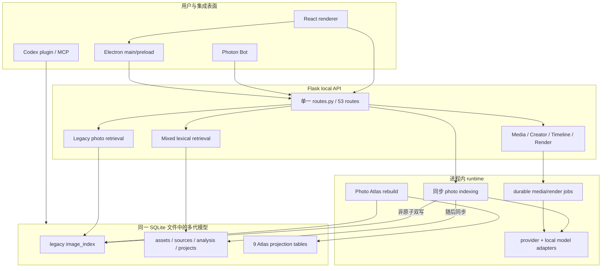

# MemoLens 全仓库架构与创新性审计

- 审计日期：2026-08-20
- 审计范围：当前 `main` 工作树中的跟踪源码、测试、构建配置、Codex 插件、Photon Bot 与文档
- 基线版本：`964f007`，tag `v0.5.0`
- 结论性质：建议，不授权代码修改
- 外部证据截止：2026-08-20

## 1. 执行结论

MemoLens 已经跨过“功能原型”阶段，但还没有收敛成一套统一架构。当前仓库由两代系统组成：

1. 旧照片链：`image_index`、同步照片 indexing、legacy retrieval、Photo Atlas。
2. 新媒体链：Asset / Source / Analysis revision、持久化 media/render jobs、Creator Memory、Brief、Timeline。

新媒体链具备明显更成熟的事务、幂等、版本、文件身份和来源校验。旧照片链仍保留原型期做法，正在制造数据分叉、权限分叉、检索语义不一致和规模上限。项目现在最重要的工作不是增加页面或模型，而是把旧照片链迁入新媒体链已经证明有效的规则。

我的总体判断：

| 维度 | 评分 | 判断 |
| --- | ---: | --- |
| 产品逻辑清晰度 | 7/10 | Memory、Director、Editor、Creator Memory 的产品线清楚，Library scope 和照片/视频路径仍分叉 |
| 局部架构质量 | 8/10 | runtime lease、idempotent write、revision/CAS、FD 路径校验、artifact hash 很强 |
| 整体架构一致性 | 5/10 | 两套 repository、三套检索、三组 projection、两套 job 生命周期并存 |
| 代码结构清晰度 | 5/10 | 目录可辨认，但 God files、`src` 命名冲突和 wire contract 手写重复已经拖累理解 |
| 测试与 CI | 7/10 | 242 项自动化检查通过，安全和领域纯函数覆盖好；缺 UI/Electron E2E、质量 benchmark、规模与迁移门槛 |
| 发布成熟度 | 4/10 | 源码运行体验较完整；缺正式打包、签名、公证、升级、回滚和 clean-machine 验证 |
| 产品组合创新 | 8/10 | 本地个人媒体记忆、显式创作者偏好、证据化创作和可修订时间线的组合有辨识度 |
| 当前算法创新 | 3/10 | 核心仍是 lexical/hash、PCA、k-means、dense cosine、规则排序；没有项目级评测证明 |
| 可验证创新能力 | 3/10 | 基线版本历史上缺 Spec 004；本轮已补 Proposed 规范，但 benchmark、隐私工件和可复现实验尚未实施与冻结 |

结论不是“推倒重来”。正确路线是保留新媒体链的强约束，建立统一媒体记忆内核和本地 capability 边界，再在它们之上验证类型化检索、分层时间记忆、可同意个性化和故事 provenance。

## 2. 审计方法与基线

本次工作包括：

- 盘点 245 个跟踪文件与约 56,153 行 Python / TypeScript / TSX / MJS 源码。
- 逐条还原 Flask、Electron、React、SQLite、Codex 插件和 Photon 的主要数据流与信任边界。
- 检查最大文件、路由数量、状态和 effect 数量、复杂度豁免、测试类型与文档依赖。
- 运行根项目 `npm run check`，104 个 Python 测试、38 个插件测试、94 个 Node/renderer model 测试和构建全部通过。
- 运行 Photon Bot 测试和构建，6 个测试通过。
- 运行更严格的 McCabe 10 静态探查，发现 19 个复杂函数；项目正式 Ruff 门槛仍为 30，且对热点文件有豁免。
- 在内存中验证 SQLite FTS5 与 JSON 能力，无项目文件写入。
- 用合成查询探测当前 lexical 与 `semantic_hash` 边界。
- 调研 GitHub Spec Kit、Immich、Ente、PhotoPrism、Nextcloud Memories、PhotoBench 和相关一手论文、标准。

本次没有运行真实私人媒体，没有读取 `.env`，没有修改业务代码。仓库开始时已有 5 个未跟踪脚本，本轮不触碰它们。

## 3. 当前架构图



图中最关键的结构问题是：同一个“照片已经进入 MemoLens”的事实，可以只存在于 `image_index`，也可以只存在于 `assets`，还可能有一个过期 Atlas projection。三个表面随后使用不同检索器读取不同真相。

## 4. 现有强项，必须保留

### 4.1 Runtime 一致性

[`RuntimeBundle` 和 lease draining](../backend/src/runtime.py#L11)保证一次请求固定使用同一个 settings、repository 和 runner generation。设置热切换先完整构造候选 runtime，再原子替换；旧 runtime 等活跃请求释放后才退休。这是成熟的并发边界。

### 4.2 新媒体链的不可变证据与版本

[`core/media_db.py`](../core/media_db.py#L57)把 analysis run/head、video segment、transcript、brief、timeline、creator profile 和 review 建模为 revision 或不可变记录。Timeline 使用 CAS 和 validation，render 绑定 timeline hash。这个方向比“覆盖一行 JSON”更适合个人记忆和可重放创作。

### 4.3 事务幂等

新媒体 mutation 把领域写入和精确 HTTP response 放在同一事务中提交，避免网络丢失响应后重试造成重复写。这一模式应成为所有 mutation 的全局标准，而不是只停留在 import、timeline 和 Inbox。

### 4.4 文件与制品完整性

新媒体读取使用 approved root、逐路径组件 `O_NOFOLLOW`、inode / size / mtime / SHA 校验。视频导出再次验证后端 URL、Content-Length、ETag、SHA，并以临时文件和 hard link 发布。它们对恶意请求参数仍能形成独立防线。

### 4.5 Electron 基础安全偏好

[`electron/main.ts`](../electron/main.ts#L152)启用了 `contextIsolation`、sandbox 和 `webSecurity`，关闭 Node integration、webview 和不可信导航。Preload 暴露具体能力而非 raw IPC。后端有每次启动 token 和身份 challenge。问题不在这些基础设置，而在少数已暴露能力过大。

### 4.6 视频工作流领域建模

Video path 有显式 reducer phase、scope guard、AbortController、mutation ledger、brief provenance、timeline revision、conflict recovery 和 render hash。Photo path 应向它对齐，不能继续以页面 state 加 prompt 拼接为主。

### 4.7 CI 基础

CI 覆盖 Ubuntu 主项目、Photon 独立 job 和 macOS runtime，包含 lint、依赖审计、Python、插件、Node、构建和 FFmpeg 测试。当前失败不是红灯堆积，而是质量门槛尚未覆盖真实用户旅程、检索效果、性能和发布产物。

## 5. P0：发布与架构门禁

### P0-S1：受信 renderer 可持久化主进程将执行的任意 executable

证据链：

- UI 允许编辑 `pythonCommand`：[App.tsx](../src/App.tsx#L1741)。
- Preload 原样传递整个 settings：[preload.cts](../electron/preload.cts#L19)。
- Main 只验证 sender，不验证 command capability：[main.ts](../electron/main.ts#L416)。
- Normalizer 接受任意非空字符串：[desktopSettings.ts](../electron/desktopSettings.ts#L57)。
- Supervisor 将其作为 `spawn` executable：[backendProcessSupervisor.ts](../electron/backendProcessSupervisor.ts#L191)。

准确风险：这不是无条件远程 RCE，也不是 shell injection。`spawn` 没有启用 shell，附加参数固定为 `backend/app.py`。它要求应用自身 XSS、依赖注入或受控开发 renderer 已经在受信主 frame 执行，目标程序对当前 OS 用户可执行，并且 backend 处于 offline 且后续触发 ensure/restart；backend 已健康时该路径不会再次 spawn。问题是 renderer 获得了持久化进程启动能力，使一次 UI compromise 能在以后跨到 main process 能力面。

现有 sandbox、`contextIsolation`、CSP、导航限制和 main-frame sender 校验降低 renderer 失陷概率，也能挡住普通第三方页面；它们在 renderer 已经失陷后不能对 `pythonCommand` 提供细粒度授权，因此不是这条数据流的独立终止条件。

建议：production renderer 不再写 raw command。Main 只接受 opaque runtime ID，或使用原生选择器加 realpath、regular executable、owner/signature/allowlist 校验，并要求原生确认。IPC 参数增加运行时 schema，开发 override 仅来自启动环境且不得持久化。

发布门槛见 [Spec 007](specs/007-local-capability-boundary/spec.md)。

### P0-S2：Photon lexical containment 可被库内 symlink 绕过

证据链：

- [`resolveImagePath`](../photon-bot/src/imageResolver.ts#L6)只对字符串 path 做 containment，随后 `stat` 跟随 symlink。
- Electron discovery 使用 `Dirent.isFile()`，通常不会接受文件 symlink；Python legacy `Path.glob(...).is_file()` 会跟随。最直接的可利用数据形态是 configured Photon library root 的根层文件 symlink，其他情况通常还需要 legacy DB 或 backend result 被污染。
- Discord 缩放失败时回退上传原路径：[discord.ts](../photon-bot/src/discord.ts#L207)。

准确风险：需要 configured Photon library root 内存在越界 symlink或后端路径被污染，还需要 allowlisted Discord 用户触发；Discord user allowlist 是启动必需项，guild 场景还要求 channel allowlist，附件另有 7.5 MB 上限。README 已披露正常 library 图片会离开设备以及 resize 失败会 fallback original，root 内普通图片分享本来就是预期能力。真正的问题只在越界 symlink/污染结果能把不属于该能力范围的文件变成附件。它不是本地提权，而是 confused deputy 式隐私外发。

建议：Photon 不再接收文件路径，只接收 opaque asset ID 和后端生成的 egress-safe artifact。过渡期必须 realpath 后二次 containment、拒绝任一路径组件 symlink、FD 级无跟随打开、decode 后重新编码到新 JPEG。任何 transcoder 失败都 fail closed，禁止 fallback original。

### P0-S3：Backend capability 规则不统一，renderer compromise 可放大为跨库写入与照片外发

这项定性为 **P0 design gate**：已经有完整的权限放大链，但需要以 compromised-renderer E2E 证明最终可达性，证据强度与 P0-S1/S2 的直接数据流不同。

现有缓解与权限差异：后端只监听 loopback；production `file:` renderer 对 `/v1` 需要本次启动 token；普通 cross-site Origin 被拒绝；新媒体 route 还有 DB binding、approved root、hash 和幂等。另一方面，配置的 trusted dev origin 会因 Origin 直接放行，originless loopback 客户端保持兼容行为；持有 token 的 renderer 本来就能调用许多本地 API。这些边界能挡远端网页和随机客户端，不能在受信 renderer 已失陷后证明用户对某次 authority change 或 egress 的意图。

完整放大链：renderer 调用 settings mutation → 把 library root/DB 改成任意存在路径 → candidate runtime 把新 root 注册为 active authority → legacy indexing 仍接受 absolute file/raw DB path → 配置了 remote VLM 与 key 时，[vision adapter](../indexing/vision.py#L54)发送 resize 后的照片 bytes。正常用户主动选择 remote profile 属于合法功能；恶意 renderer 切换 profile/root 并触发分析才是缺少独立确认和 payload grant 的问题。视频外发已有更严格的禁用/授权预留，旧照片链没有同等级 single-use grant 与 manifest。

需要统一的声明式规则：

- 每个 route 标注 read、mutation、filesystem read、egress。
- 普通 domain mutation 使用 session/library binding、revision/CAS 和 idempotency；authority-changing/high-impact mutation 额外要求短期 operation capability。
- 所有文件读取使用 root capability 和相对 asset identity，不再以 raw path 作为 authority。
- 所有远端 provider 请求有 asset/field/provider/model/bytes/hash/expiry/single-use manifest。
- Origin 只证明来源，不自动授予写权限；originless 默认最小只读。

### P0-A1：两代数据模型和非原子双写

[`core/db.py`](../core/db.py#L10)定义 legacy `image_index`；[`core/media_db.py`](../core/media_db.py#L21)定义新媒体账本；[`core/photo_atlas.py`](../core/photo_atlas.py#L19)拥有 9 张 projection 表。照片 indexing 先写 legacy row，再调用另一个 repository 同步 asset：[pipeline.py](../indexing/pipeline.py#L234)。两个事务中任一阶段失败都会留下半写。

反方向也不完整：新 media import 的 image 不一定进入 legacy retrieval 和 Atlas；mixed search 对缺少 legacy row 的图片只能看到有限文字。Startup backfill 又在数据库初始化阶段全扫旧记录和文件系统。

建议：

- 文件系统或系统媒体库是原始事实源。
- 一个 canonical Asset / Source / Analysis ledger 是应用权威数据。
- Search、Atlas、Inbox、Codex 都是可删除、可重建、有 generation 的 projection。
- canonical mutation 与 outbox/change record 在同一事务。
- 过渡期使用 compatibility view/adapter，不再 service-level 双写。

### P0-A2：默认“image embedding”不看像素，却驱动视觉和重复判断

默认 backend 是 `semantic_hash`。[`encode_semantic_text`](../core/semantic_vectors.py#L25)只对词项和相邻词哈希；[`EmbeddingService.encode_image`](../indexing/embeddings.py#L35)在该 fallback 下也只使用描述或文件名，不读取像素。Atlas 随后把这些向量用于视觉相似和 duplicate graph。

本次合成实验：

| 查询 | 文档 | `semantic_hash` cosine |
| --- | --- | ---: |
| 海边落日 | 黄昏时分的沙滩与海浪 | 0.0000 |
| 祖孙重逢拥抱 | grandmother embraces her granddaughter | 0.0000 |
| birthday child | toddler blowing out candles at a party | 0.0000 |
| birthday cake | birthday celebration cake candles | 0.6118 |

这能做确定性 lexical fallback，不能称为视觉语义 embedding，也不能可靠判断近重复。

建议建立 versioned embedding artifact：space、model、revision、dimension、dtype、preprocess、input hash 和设备/runtime。视觉语义、实例近重复、文本和人物敏感信号分开存储和评测；不同 space 永不直接 cosine、补零或截断混算。

### P0-A3：Atlas 全量 O(N²)、混向量空间且跨进程不确定

Atlas rebuild 全量读取 `image_index`，对所有向量计算 dense `vectors @ vectors.T`，将不同维度向量补零或截断到众数维度，并在 PCA 2D 布局上做 k-means。理论上 float32 相似度矩阵：10k 约 0.37 GiB，50k 约 9.31 GiB，100k 约 37.25 GiB，未含其他数组。

Fallback 中还有 Python 随机化 `hash()`，同一输入跨进程布局可不同。Atlas UI 也执行最多 80 次 O(n²) 力导向迭代。

建议：

- 在同一原始 embedding space 上建立增量 kNN。
- 展示布局与聚类语义分离；PCA/UMAP 只负责画布。
- cluster 可在真实相似图、事件和时空信号上评估 HDBSCAN、Leiden 或简单事件分割。
- generation 原子切换，支持 single-flight、版本化 stale 判断和增量/全量等价测试。
- 在真实数据 bake-off 前不指定某个 ANN 或图数据库。

### P0-A4：照片“job”是同步请求，不可恢复且存在 source TOCTOU

`POST /v1/indexing/jobs` 在 HTTP 请求线程中同步调用 [`IndexingService.run`](../indexing/pipeline.py#L100)。它串行处理每张图，外部 provider 单次 timeout 可很长；job ID 只是秒时间且不持久化。文件 hash、模型读取和质量读取分多次按路径打开，源在中间被替换时可能出现保存 hash 与实际分析内容不一致。

建议让照片和视频共用持久任务状态机：冻结 manifest/FD identity、分阶段 checkpoint、可取消、进程重启恢复、每资产不可变 analysis revision、最后原子 publish head。HTTP 只创建 job 并返回稳定 ID。

## 6. P1：高优先级结构问题

### P1-1：三个检索器没有共同查询语义

Legacy retrieval 有多信号打分与 MMR；Atlas 有自己的术语、alias、filter 和相似图；Mixed retrieval 明确是 lexical fallback，[`rank_candidates`](../backend/src/media/mixed_ranking.py#L57)只匹配词项。相同自然语言在 Photo、Video 和 Atlas 会得到不同含义、不同证据和不同空结果行为。

解决办法不是把旧文件合并，而是定义一个稳定 query IR 和 result evidence contract。视觉、时间、地点、人物、关系、事件、媒体类型、质量、否定和排序独立表达。检索源分别召回，融合器保留每个候选被加入、降权或排除的理由。详见 [Spec 009](specs/009-intent-evidence-retrieval/spec.md)。

### P1-2：Creator Memory 在 Photo 与 Video 中语义不同

Photo 把 platform、frame、pace 等字段拼进自然语言 retrieval prompt；Video 保存 profile ref、revision、content SHA 和 applied fields。结果是 `9:16` 或 `YouTube` 可能意外影响照片召回，而 Photo provenance 只留在 React state、刷新后丢失。

建议建立 Creator Context Compiler，将 confirmed profile、project override 和当前 task 分层，输出 retrieval constraints、directing/ranking policy、copy/tone policy、render/output constraints 与 immutable provenance ref。Photo 与 Video 使用同一个 compiler contract。

### P1-3：God files 重新长大，违反仓库自己的边界规则

| 文件 | 行数 | 主要问题 |
| --- | ---: | --- |
| `core/photo_atlas.py` | 3,566 | schema、向量、聚类、图、角色、stack、查询全在一处 |
| `src/styles.css` | 3,680 | 全局样式跨 feature，缺视觉回归后难清理 |
| `src/App.tsx` | 2,834 | 39 个直接 `useState`，路由、library、settings、index、Creator、Photo 全局编排 |
| `core/media_db.py` | 2,526 | 22 张表与约百个 repository 操作 |
| `backend/src/api/routes.py` | 2,406 | 53 routes 和 composition 辅助逻辑 |
| `src/VideoWorkbench.tsx` | 2,067 | controller、恢复、轮询、mutation 与所有步骤 UI |
| `src/AtlasView.tsx` | 1,011 | fetch、布局、图交互和视图 |
| `src/query/api.ts` | 915 | 多领域 transport、normalization 和直接 cast |

[`CONTRIBUTING.md`](../CONTRIBUTING.md#L31)已经规定 route 只做 HTTP glue、React page 只组合 hooks、超 1,000 行文件不再增加第二职责。实现已偏离自己的规则。

建议按责任拆，不按行数机械拆：

- `AppShell`：workspace/router、library session、error boundary。
- application controllers：Library、Photo Story、Creator Context、Video Project。
- Flask blueprint：Library、Analysis、Retrieval、Memory、Creation、Operations。
- repositories：Asset catalog、Analysis ledger、Projection、Creative、Operation journal。
- transport 和 generated contracts 独立于页面与领域逻辑。

### P1-4：隐藏页面仍执行副作用

访问过 Create 后，整棵 Create tree 常驻；VideoWorkbench 只被 `hidden`。Capabilities、job recovery 仍会执行，有 active job 时每约 1 秒轮询，即使用户位于 Home、Library 或 Photo Create。

建议把全局 job observer 与页面 controller 分离。页面接收显式 `active` 并在 inactive 时停止请求、timer 和 controller；真正需要跨页面跟踪的 job 进入单一 operation observer。

### P1-5：HTTP/IPC contract 与错误模型手写重复

`src/query/types.ts`、`src/video/types.ts`、Python dict、route response、IPC main/preload/type declaration 多处手工同步。`dict[str, object]` 横跨 repository、service 和 API。Query API 有直接 cast，错误有时被吞掉或退化成自由文本。

建议用 OpenAPI/JSON Schema 作为 wire contract 单一来源，生成 TS client 和 Python validation。领域对象不直接依赖 wire DTO。统一错误字段：code、retryable、request_id、operation/library scope、safe detail。IPC 也使用共享 channel registry 和运行时 schema。

### P1-6：资源生命周期与可观测性不完整

Repository 持有 output root FD，runtime retirement 只 shutdown runners，没有统一 close。模型 lazy load 缺 single-flight 和全局预算；连续 reload 可能积累 FD、模型或客户端。Vision、planner、copywriter 的 broad fallback 又可能把质量下降隐藏在“成功”中。

建议所有 runtime extension 实现幂等 close；100 次 reload 后 FD/GPU/model instance 回到稳定基线。每个分析阶段产生 typed outcome，区分真实模型、fallback、partial 和 failed，日志脱敏，health 可按 model/space/fallback reason 汇总。

### P1-7：模型供应链边界

Text embedding 当前可使用 `trust_remote_code=True` 加载可配置 model ID。生产应关闭 remote code，或使用 allowlist、固定 revision/hash、独立加载进程和许可证清单。模型、预处理、runtime、权重和 embedding schema 必须共同版本化。

### P1-8：Electron 生命周期与正式发布缺口

项目没有 single-instance lock、等待式后端退出、renderer crash recovery、正式 package/sign/notarize/update。现有脚本复制 Electron.app、ad-hoc 签名，并从源码目录启动，bootstrap 还执行依赖安装。

这些内容已经单列为 [Spec 013](specs/013-desktop-reliability-verifiable-release/spec.md)：按 `arm64`/`x86_64` 发布 notarized artifact，bundled Python/FFmpeg 进入资源清单，补 single-instance/sidecar lease、SBOM、构建 provenance、N-1 migration、失败恢复、升级回滚和 clean-VM smoke。没有这些工件前，项目应称为源码运行型预发布版。

### P1-9：UI 与系统级测试缺口

94 个 TS/Node 测试主要覆盖 model、adapter 和 coordinator，没有真实挂载 `App`、VideoWorkbench、AtlasView，也没有通过真实 preload/main/backend 做 E2E。缺少 accessibility、visual regression、崩溃恢复、磁盘不足、旧 scope 响应、应用重启和打包产物测试。

## 7. P2：目录与治理

### 7.1 当前目录清晰度

优点：`backend`、`core`、`indexing`、`electron`、`src`、`photon-bot` 和插件大体能找到入口；`.gitignore` 对数据库、媒体、env、cache 和构建产物治理清楚。

问题：

- repo-root React `src/` 与 Python `backend/src/` 同名，启动时必须手改 `sys.path`：[backend/app.py](../backend/app.py#L9)。
- `src/query` 实际包含 Atlas、settings、desktop、mock、photo generation 等多种职责。
- `frontend/querying` 是 legacy compatibility facade，`frontend/src` 为空，增加了“哪个 frontend 才是真的”认知成本。
- Codex 集成有约 8.5k 行，却藏在 `.agents/plugins/plugins/memolens`，缺独立版本和 release owner。
- 根 TypeScript 与 Photon 使用不同 TS major 和 lockfile，没有 workspace 或共享 contract 包。
- `docs/autonomous-iterations.md` 的 “Next Queue” 已含现有能力，005 状态仍是 Proposed 而功能已进入后续版本；文档治理与实现状态脱节。
- 005、006 多次依赖的 Spec 004 在基线仓库历史中缺失；本轮已补为 Proposed Spec Kit feature directory，但尚未实施或冻结 benchmark run。

### 7.2 建议目标目录

这是一张目标边界图，不是立即搬迁清单：

```text
apps/
  desktop/
    renderer/
    electron/
  photon/
python/
  memolens/
    bootstrap/
    domain/
      library/
      analysis/
      retrieval/
      memory/
      creation/
      policy/
    application/
    adapters/
      sqlite/
      filesystem/
      ffmpeg/
      models/
    api/
    workers/
integrations/
  codex/
contracts/
  http/
  ipc/
tests/
  unit/
  contract/
  integration/
  e2e/
  eval/
  performance/
  migrations/
docs/
  adr/
  specs/
  research/
```

依赖方向固定为：surface → application use case → domain → port；adapter 实现 port。API route、Electron handler、MCP tool 和 Bot 都是 surface，不拥有领域规则。保持进程内模块化单体，不因目录变整齐就引入服务网络。

## 8. 创新性判断

### 8.1 已经成立的产品创新

MemoLens 的差异化不是“能搜照片”或“能让 LLM 写文案”。真正有价值的是下列组合：

- 私人媒体长期留在用户控制的 library。
- 图片和视频片段可跨项目复用，不是一次上传一次生成。
- Creator Memory 需要用户确认，并保留 revision 和证据。
- Brief、Timeline、Render 有 revision、hash 和来源。
- Codex 是推理表面，App 保持状态和确认权威。

市场和开源项目分别覆盖其中一些能力，但把个人媒体记忆、显式创作者上下文和证据化可编辑创作串成一个本地工作台，仍有清晰产品创新。

### 8.2 尚未成立的算法创新

当前 retrieval/Atlas 主要依赖 lexical、text-derived hash、PCA、k-means、dense cosine、MMR 和规则 director。它们合理但不是新的算法贡献。基线仓库历史上缺少 Spec 004；本轮虽已补写 Proposed 规范，项目仍没有实际冻结数据、baseline、指标、run artifact 和隐私工件，因此还不能证明比现有方案更好。

### 8.3 可以形成下一代优势的方向

1. **可证明的 Local Capability Plane**：每次读取、模型外发、导出和命令启动都有 operation/root/time scoped capability 与 disclosure ledger。
2. **Canonical Evidence Ledger**：原始媒体、不可变 observation、分析 revision、事件、偏好和故事 claim 在一条可追溯链上。
3. **Typed Intent Compiler**：视觉、时间、地点、人物关系、事件、否定和排序明确编译；embedding 不再承担所有逻辑。
4. **Familiarity / Recollection 双路径**：常见查询走便宜快路径，只有低置信、冲突和多跳问题进入事件图与 VLM 定向回看。
5. **Consentful Creator Model**：用户用少量高信息反馈修正检索和创作策略，每次学习可见、可撤销、可限定范围。
6. **Evidence-first Story Compiler**：先形成带 source span 的 beat/shot card，再生成文案和时间线；导出 provenance 是编译产物。

这些方向都在 004 的 benchmark 下接受证伪。达不到预注册提升时应停止，而不是用更大的模型掩盖架构问题。

## 9. 分阶段建议

### 0 至 30 天：发布门禁与基线

- 冻结 Spec 004 的数据、指标、环境和原始结果。
- 关闭 raw Python command 和 Photon original fallback。
- 建立 route capability inventory，统一 mutation/egress 最低要求。
- 为当前 lexical、legacy hybrid、Atlas duplicate 和 Photo/Video 用户旅程生成 baseline。
- 修复隐藏 VideoWorkbench 副作用，增加根 Error Boundary。
- 不进行目录大迁移。

### 30 至 90 天：统一内核

- 引入 canonical library ID、database UUID、asset/source/analysis identity。
- 照片 indexing 迁入 durable media job，保留 legacy projection adapter。
- 统一 SQLite connection/UoW、outbox、operation journal 和 extension close。
- 建立 versioned embedding contract；禁止 mixed space。
- HTTP/IPC schema 单一来源和 contract tests。
- Atlas 改为 generation projection，先消除 O(N²) 和 nondeterminism。

### 90 至 180 天：可证伪的能力跃迁

- 在 PhotoBench 和 MemoLensBench 上验证 typed intent compiler。
- 建立事件/segment 层级与 query-guided refinement。
- Creator model 先 shadow，反馈不影响默认结果；与随机策略比较。
- Story compiler 先要求 claim evidence coverage，再接 C2PA export adapter。
- 按 Spec 013 完成正式 macOS artifact、签名、公证、clean-machine、N-1 升级和数据回滚测试。

完整依赖见 [roadmap](specs/roadmap.md)。

## 10. 验收矩阵

| 目标 | 必须看到的证据 |
| --- | --- |
| 安全 | compromised-renderer、symlink/TOCTOU、originless mutation、egress grant 负向测试全部 fail closed |
| 一致性 | 每个写阶段 fault injection 后无 orphan/half-write；projection 可删除重建且 hash 稳定 |
| 检索 | 固定数据上的 nDCG/Recall/constraint precision/no-answer 指标，按来源数量分桶 |
| 时间记忆 | segment R@k、temporal IoU、边界误差、摘要反向引用完整率 |
| 个性化 | 相同反馈预算下对比 random；holdout 回归、撤销、漂移和范围隔离 |
| provenance | claim coverage、citation correctness、artifact replay、tamper detection |
| 性能 | 1k/10k/100k corpus 的 p50/p95、peak RSS、FD、存储、ingest cost |
| 生命周期 | process kill、取消、重启、DB busy、disk full、100 次 runtime reload |
| UI | 真实 DOM、preload/main/backend E2E、accessibility、visual regression、inactive polling 为零 |
| 发布 | clean VM install、签名/公证、SBOM、升级 migration 和 rollback |

## 11. 关键风险与不建议动作

- 不把成熟的 FD 校验、revision/CAS 和事务幂等在重构中退化。
- 不把多个 SQLite 表物理合并误认为统一领域模型。
- 不把某个向量库或图数据库当成创新本身。
- 不用平均分掩盖复杂多来源查询的退化。
- 不把“没有网络请求发生”误等同于“隐私设计完成”；还要验证撤销、删除闭包和派生数据。
- 不把 renderer sender check 当作细粒度授权。
- 不让日志、health 或 Bot 输出绝对私人路径。
- 不在没有用户确认和回滚时把模型推断固化成 Creator Memory。

## 12. 结论

MemoLens 值得继续投入。它的强点是真实的工程机制和产品组合，不是表面概念。现在最危险的做法是继续在旧照片链和大页面上加功能；最有价值的做法是把已经在视频链中成立的不可变证据、持久任务、事务幂等、来源校验和 revision 规则推广为全局内核。

只要先完成 004、007、008，并以 013 关闭桌面交付门槛，再以 009 至 012 的可证伪实验推进，MemoLens 有机会从“本地 AI 相册与剪辑原型”跃迁成“可验证的个人媒体记忆操作系统”。这个定位既有全局架构支撑，也能通过具体指标被证明或推翻。
