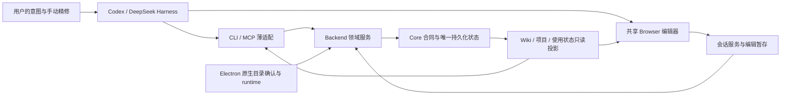

# 当前代码的职责与产品链

这是 2026-09-04 当前工作树的导航图；“有入口”与“完整用户旅程已验证”分开记录。用户要求与来源见 [需求矩阵](requirements.md)，本轮问题与验证见 [复核入口](overview.md)。

## 谁负责什么

原文件只经已登记 source 与范围解析使用。Browser 暂存编辑不直接写 SQLite；成功保存经 Core 创建新 revision，随后重新读当前状态。外部 Agent 的语义推理和用户的创作决定不是媒体事实本身。

| 层 | 现有代码入口 | 职责 / 不应继续混入的职责 |
| --- | --- | --- |
| 宿主适配 | `.agents/plugins/plugins/memolens/{.mcp.json,client.js,cordis.patch.yml}` | 注册工具和打开编辑器；不建立第二个聊天、模型账户或项目数据库 |
| Agent 操作 | `scripts/memolens_cli.py`、`memolens_mcp.py`、`memolens_agent_client.py`（插件内） | 读取当前状态、受限写请求与跨 Agent 续接；不让自由文本变成已确认事实 |
| 可视编辑 | 插件 `ui/canonical-editor.html`、`scripts/memolens_canonical_editor.py`、`memolens_editor_server.py` | 当前 revision、选中素材、暂存/保存/历史/预览共用一条状态链；Draft Lab 独立标为未保存 |
| 本地权限 / 生命周期 | `electron/libraryBootstrapCoordinator.ts`、`agentAuthorityCoordinator.ts`、`backendManager.ts` | 原生目录确认、配对与后端管理；Electron 工作台不再承担主剪辑器方向 |
| 扫描 / 分析执行 | `backend/src/media/library_scan.py`、`video.py`、`image_analysis.py` | 批次发现、import 后提交 child、恢复与取消；scan 完成仅表示发现/导入结束，不表示全部语义分析完成 |
| 领域编排 | `backend/src/media/{blueprint,coverage,timeline_lowering,timeline,canonical_export}.py` | 编排现有合同与事务，核对上游版本；lowerer 不另建自由素材 planner |
| 合同 / 持久化 | `core/media_db.py`、`library_scan_persistence.py`、`image_analysis_persistence.py`、`*_contract.py` | 唯一媒体与项目账本、原子提交、版本和恢复；新领域应优先放已有领域模块，避免继续扩大总文件 |
| 兼容投影 / 旧表面 | `core/photo_atlas.py`、`core/db.py`、`src/App.tsx`、`src/VideoWorkbench.tsx` | 维持现有使用与迁移；仍有生产调用，不能直接删除或搬走 |

## 一次创作穿过哪些状态

| 阶段 | 产生的事实 | 当前实现与缺口 |
| --- | --- | --- |
| 连接 Library | 原生确认绑定、V20 bootstrap receipt、scan job、project、未验证 Blueprint | 已实现并有 2026-08-30 本地证据；真实原生冷启动与扫描到编辑完整旅程仍待证明 |
| 扫描与导入 | 稳定 asset/source、批次 checkpoint、child job | 已实现；本轮修复 scan 占用分析执行槽和总字节导致批次无进展的问题 |
| 理解与导航 | 图片分析 observation、视频精确 span、Wiki 只读证据 | canonical image 与 live Wiki 有实现；完整 Wiki generation/pinning 与当前 Agent 的 bounded multimodal 写回仍缺 |
| 形成 Blueprint | 用户意图、文稿、素材引用、未知项与版本 | 已有持久化提案与受限 Agent 写入；未验证提案不会自动变成用户确认 |
| Coverage | 每段需要什么、哪些片段可用、Assignment / Gap | deterministic baseline 已实现；音频信号、全局优化与成片比较实验尚未交付 |
| Timeline | 由 Blueprint / Coverage 降低得到可执行片段 | lower/edit/split/remove/history/restore 有实现；完整声音、字幕、转场与统一跨资源 undo/redo 仍缺 |
| 可视精修 | 暂存候选 → 保存新 revision → 重新读取 | Codex / DeepSeek 共享 Browser；本轮修复图片显示与播放状态、恢复提示 |
| 导出与再次创作 | 成功 Export、精确 Usage、剩余片段与轻量包 | canonical silent export 与 residual/exclusion 有实现；full package、relink、Usage correction 和完整作品体验仍缺 |

## 对既有大量改动的判断

有明确保留价值：把图片/视频来源与分析版本纳入 canonical 体系；唯一 Blueprint→Coverage→Timeline→Export 链；追加式历史；成功导出产生具体区间使用事实；Codex/DeepSeek 共用剪辑器。它们对应用户的长期素材库、跨 Agent、可回撤与剩余片段要求。

需要纠正的实现：逐批提交 child 却把所有任务放进同一串行队列；只以 clip ID 管理图片加载；用同一段 Refresh 文案覆盖权限、历史、格式、素材变化等不同原因。这些问题都发生在组件拼接处，单独模块存在或局部测试通过不能证明使用链成立。

仍有结构债：`core/media_db.py` 在本轮起点为 28,196 行，`backend/src/api/routes.py` 与 `src/blueprint/BlueprintProjectWorkspace.tsx` 也集中了多个领域。直接移动大文件不会消除事务依赖，并会放大当前未提交工作树的回归范围。本轮先把调度职责在代码中拆开；后续持久化提取应以一个完整领域为单位，保持现有 repository API、迁移 checksum、SQL 事务和调用者契约，再逐个退役旧入口。

## 开源建议如何落到本项目

用户要求参考 OpenCut/OpenChatCut/ChatCut 的剪辑交互和插件形态。已有 [逐仓库来源记录](../../specs/015-agent-agnostic-creative-protocol/slices/015-b2b4-codex-deepseek-canonical-editor-handoff/editor-donor-adoption-2026-08-29.md) 给出冻结 commit、许可与采用范围。实际采用的是共享编辑器、时间标尺、播放头、缩略图、拖动、裁剪、Split/Remove、插件打开入口；并未宣称已经复制或集成完整第三方 NLE 内核。

2026-09-04 重新读取了 [ChatCut 插件仓库](https://github.com/ChatCut-Inc/agent-plugin)、[OpenCut](https://github.com/OpenCut-app/OpenCut) 和 [OpenChatCut](https://github.com/NeuraSea/open-chat-cut) 的公开页面；该复查不改变既有逐文件许可与 provenance 要求。后续若实际复用 donor 代码，需记录具体源文件与本地适配，并验证它服务 MemoLens 的同一 canonical 状态链。

## 后续工作优先级

1. 让一个 Library 中首批有证据的素材尽早可用，并跑通实际创建 / 续接 / 精修 / 导出链。
2. 完成 Agent bounded analysis exchange 与 Wiki generation：语义能力可来自用户当前 Agent，避免变相要求另配模型账户。
3. 补声音、文字匹配、字幕和基础转场，建立音画 source mapping 与成片预览；不把静音源预览叫作专业成片。
4. 统一跨资源历史、项目包与 relink，再验证干净机器和分发。
5. 以完整作品、用户替换次数和预注册对照评价 Global Assignment 与 Craft Compiler；实验未达标就调整或终止。

这些是依赖顺序，不是把 15 份父规范机械排成待办。具体下一步必须根据实际失败和已可用能力缩小到可交付的用户结果。
