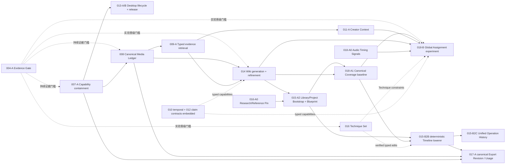

# MemoLens Next-generation Roadmap

2026-09-04 复核：本页已同步 A2 Phase 0–3 的 2026-08-30 本地证据。最新需求追踪、调度与界面问题，以及修复后的验证见 [全局复核入口](../audits/2026-09-04-convergence/overview.md)。V0–V8 的退出门槛不随文档同步自动完成。

- 状态：`PORTFOLIO CONVERGED / STAGED IMPLEMENTATION AUTHORIZED / B2B4A+B+B.1+C AND ML-017-A3 VALIDATED_CONTROLLED_LOCAL / A2 PLUGIN-FIRST PHASE 0-3 VALIDATED CONTROLLED LOCAL / PARENT REAL-HOST AND REMOTE RELEASE BLOCKERS REMAIN`
- 实施记录：`ML-014-A0 COMPLETE / ML-015-A0 COMPLETE / ML-015-A1 COMPLETE / ML-015-A2 PHASE 0-3 IMPLEMENTED (CONTROLLED LOCAL; REAL LIBRARY-TO-EDITOR PENDING) / ML-015-B0 COMPLETE / ML-015-B1 COMPLETE / ML-015-B1A LOCAL GO (0.10.1 CANDIDATE) / ML-015-B2A IMPLEMENTED (ADMISSION PENDING) / ML-018-A1 IMPLEMENTED (LOCAL GATE PASS, RESIDUALS) / ML-015-B2B+B2B2+B2B3 IMPLEMENTED (LOCAL GATE PASS, RESIDUALS) / ML-015-B2B4+B2C0 IMPLEMENTED (PARENT PROMOTION BLOCKED) / ML-015-B2B4A+B2B4B+B2B4B.1+B2B4C IMPLEMENTED (VALIDATED_CONTROLLED_LOCAL; REAL-HOST PROMOTION PENDING) / ML-008-A0.1 IMPLEMENTED (CONTROLLED-LOCAL GATES PASSED; PROMOTION BLOCKED) / ML-017-A+A2+A3 IMPLEMENTED (VALIDATED_CONTROLLED_LOCAL; PARENT V4 INCOMPLETE)`
- 证据截止：2026-08-30
- 0.10.1 candidate 本地证据：[ML-015-B1A Implementation Evidence](015-agent-agnostic-creative-protocol/slices/015-b1a-authority-runtime-hardening/implementation-evidence.md)
- B2A 本地证据：[ML-015-B2A Implementation Evidence](015-agent-agnostic-creative-protocol/slices/015-b2a-canonical-blueprint-workspace/implementation-evidence.md)
- Plugin-first bootstrap A2：[ML-015-A2 Specification](015-agent-agnostic-creative-protocol/slices/015-a2-plugin-first-library-bootstrap/spec.md) (`IMPLEMENTED / PHASE 0-3; VALIDATED CONTROLLED LOCAL`; [实施证据](015-agent-agnostic-creative-protocol/slices/015-a2-plugin-first-library-bootstrap/implementation-evidence.md))
- Coverage A1 本地证据：[ML-018-A1 Implementation Evidence](018-script-coverage-global-footage-assignment/slices/018-a1-canonical-coverage-plan/implementation-evidence.md)
- Timeline B2B 实施证据：[ML-015-B2B Implementation Evidence](015-agent-agnostic-creative-protocol/slices/015-b2b-deterministic-timeline-lowering/implementation-evidence.md)
- Timeline B2B3 实施证据：[ML-015-B2B3 Implementation Evidence](015-agent-agnostic-creative-protocol/slices/015-b2b3-canonical-timeline-revision-edit/implementation-evidence.md)
- Codex/DeepSeek Canonical Editor 证据：[ML-015-B2B4 Implementation Evidence](015-agent-agnostic-creative-protocol/slices/015-b2b4-codex-deepseek-canonical-editor-handoff/implementation-evidence.md)
- Verified visual replacement 证据：[ML-015-B2B4A Implementation Evidence](015-agent-agnostic-creative-protocol/slices/015-b2b4a-verified-visual-replacement-review/implementation-evidence.md)
- Safe canonical playback 证据：[ML-015-B2B4B Implementation Evidence](015-agent-agnostic-creative-protocol/slices/015-b2b4b-safe-canonical-playback-grant/implementation-evidence.md)
- Preview transport audio truth 证据：[ML-015-B2B4B.1 Implementation Evidence](015-agent-agnostic-creative-protocol/slices/015-b2b4b1-preview-transport-audio-truth/implementation-evidence.md)
- Canonical structural edit 证据：[ML-015-B2B4C Implementation Evidence](015-agent-agnostic-creative-protocol/slices/015-b2b4c-canonical-structural-edit/implementation-evidence.md)
- Export A 实施证据：[ML-017-A Implementation Evidence](017-export-usage-ledger-material-package/slices/017-a-canonical-export-usage-ledger/implementation-evidence.md)
- Exact residual/derivative exclusion A3 证据：[ML-017-A3 Implementation Evidence](017-export-usage-ledger-material-package/slices/017-a3-exact-residual-derivative-exclusion/implementation-evidence.md)
- 产品决策：[43 问产品对齐记录](product-decisions-43-questions-2026-08-22.md)
- 实现裁决：[Spec ↔ 实现决策复核](implementation-decisions-2026-08-20.md)
- 专项调研：[Agent 可导航媒体 Wiki 调研](../agent-media-wiki-research-2026-08-22.md)
- 组合收敛：[Spec Portfolio Convergence](portfolio-convergence-2026-08-23.md)

## 1. 产品跃迁目标

MemoLens 的第一阶段用户是拥有大量本地照片/视频的个人自媒体创作者。产品最终要把“素材很多，但不知道发什么、写什么、怎么给文稿配画面、也懒得剪”变成一条低摩擦、可共创的链：

```text
用户只选择一个本地 Library
  → Canonical Media Ledger 记录素材事实与精确时间证据
  → Agent-Navigable Media Wiki 作为可固定、可重建的导航 projection
  → 用户以意图 / 文稿 / 口播 / 参考 / 指定素材任一方式开始
  → Creative Blueprint 固定本次立场、脚本、创意、参考与约束
  → Coverage Plan 拥有 Beat/Need、全片素材分配、gap 和权衡
  → 经验证的 Technique Set 作为可选约束
  → deterministic lowerer 生成可编辑 Timeline Revision 与 first cut
  → 用户在对话与工作台继续细调，共用 Operation Ledger
  → 成功 Export Revision 原子产生 Usage Facts 和本地轻量包
  → 已用区间、剩余画面和历史作品反哺下一次创作
```

MemoLens 不内置第二套聊天或单独模型账户。Codex、DeepSeek Harness 或其他兼容 Agent 是创意对话与语义推理表面；MemoLens Core/CLI 是唯一受控的素材、项目、操作、渲染和导出能力。用户是思想家/导演，AI 是实干者与见多识广的建议者；一键生成与深度共创是同一条项目链的不同交互深度。

权威链不允许重叠真源：legacy brief/storyboard 只作迁移输入或 projection；Blueprint 不复制保存 Coverage assignments；Timeline 不倒推用户立场；Operation Ledger 只记录变更。ML-012 的最小 claim/evidence taxonomy 内嵌到 Blueprint/Coverage/Export，完整 Story Graph 不成为另一份 canonical project state。

创新判断只看用户结果和证据：是否更快得到可接受的完整初剪、是否减少素材重复和人工替换、是否保持原件不动与历史可重放。Wiki、图、LLM、Agent、模板或 Card 数量都不能单独证明创新。

## 2. 分层依赖关系



这张图表达切片级逻辑前置，不要求整份父 Spec 全部完成后才开始下一份。特别是：ML-012 Story Compiler 不再是 ML-014/018 的整体前置；只有它的最小 claim/evidence contract 被内嵌。B2B 不再自由规划素材；它只把已验证 Blueprint/Coverage/Technique/capability 确定性降低为 Timeline，避免与 ML-018 建立第二个 planner。ML-017-A 可在高级 Craft Wiki 之前交付，Usage Ledger 是事实源，Wiki 只消费其 projection。

## 3. V0–V8 纵向交付顺序

用户已授权按调整后的组合顺序持续实施，但这不把任何未实现切片改名为已交付。每个 V-stage 都必须以用户可观察结果退出，不以新表、新类、新 Card 或测试数量代替产品结果。

### V0：安全且可恢复地启动

范围：004-A + 007-A + 013-A，及非 active Workbench 停止无意义 polling。

- 正常用户不输入 Python、FFmpeg、DB path 或 provider key。
- 未授权 root/DB/source/egress 成功数为 0；未记录 provider payload 字节为 0。
- 重启后无孤儿 writer，任务进入明确可恢复终态。
- 当前 Library、search、create、preview、export/failure 和 CLI 旅程的 red/green baseline 被冻结；允许诚实 red。

### V1：一个文件夹即可开始

范围：008-A + 015-A2 Library/Canonical Project Bootstrap + 014-A1 materialized generation/pinning。

- 干净环境中用户只做一个概念决定：选择 Library。
- Agent 可发起意图，root authority 只由 Desktop/main 的一次原生确认签发。
- 建立同一 Library identity、可恢复索引 operation、canonical project 和最小 Blueprint；不产生 surface-specific 真源。
- 深度分析未完成时首批素材已可搜；显示已覆盖、未覆盖、未知和项目优先范围。
- 任一阶段 kill/restart 后半成品 generation 不成为 current。

### V2：Agent 能看懂少量正确证据

范围：009-A + 014-A2 Bounded Multimodal Analysis Exchange + 018-A0 Audio Timing Intelligence + 016-A0 Research Snapshot/Reference Pin。

- 文稿/查询返回精确图片 asset 或视频 `[start_ms,end_ms)`，不用整文件摘要冒充剪辑证据。
- Core-issued request 只向当前候选交付 bounded panel/audio/short span；每次外发有 disclosure manifest。
- structured observation 经 Core 验证后进入新 analysis revision；Agent 不直接写 Wiki 真源。
- 本地确定性 audio signal 与模型/Agent speech/breath hypothesis 分开；无能力时不伪称已完成气口判断。
- 用户提供的 URL/参考可以带 source、freshness、digest 和 rights/usage 固定到当前项目。

### V3：第一条可播放初剪

范围：011-A + 018-A Beat/Coverage baseline + 015-B2B + Timeline Capability Registry/已有编辑基础。

- 一句意图、文稿或口播形成 Blueprint 和可编辑的 8–20 Beat Coverage Plan。
- 每个候选和 Timeline clip 回到 Beat/Need、match type、analysis revision 与 source span；gap 不用无关候选填满。
- B2B 只把 validated Blueprint/Coverage/Technique/capability 确定性降低为 Timeline，产生 immutable binding/manifest 并检测 stale Timeline。
- 用户得到可播放 preview，并能 replace/trim/reorder/subtitle/audio level。

当前 A1、[B2B revision-1 lowerer](015-agent-agnostic-creative-protocol/slices/015-b2b-deterministic-timeline-lowering/spec.md)、[B2B2 V9 reconciliation/inspection](015-agent-agnostic-creative-protocol/slices/015-b2b2-timeline-reconciliation-inspection/spec.md) 与 [B2B3 canonical revision edit](015-agent-agnostic-creative-protocol/slices/015-b2b3-canonical-timeline-revision-edit/spec.md) 已交付。[B2B4/B2C0](015-agent-agnostic-creative-protocol/slices/015-b2b4-codex-deepseek-canonical-editor-handoff/spec.md) 又交付两种 host 共用的 project-bound Browser UI、paired Timeline write、只读 K 与显式 K→N+1 restore；[B2B4A/B](015-agent-agnostic-creative-protocol/slices/015-b2b4b-safe-canonical-playback-grant/spec.md) 增加 verified visual replacement 和独立授权的 source preview，[B2B4B.1](015-agent-agnostic-creative-protocol/slices/015-b2b4b1-preview-transport-audio-truth/spec.md) 明确 raw MP4 transport 可能含音频，页面禁止 audio playback 并保持 output muted，不证明 stream/content/mix/final fidelity。[B2B4C](015-agent-agnostic-creative-protocol/slices/015-b2b4c-canonical-structural-edit/spec.md) 在同一 Browser Canonical Editor 交付 video **Split at playhead** 与 **Remove clip from Timeline**，Remove 不删原始媒体。Electron 仅作 native authority/runtime/broker 与兼容 reader。controlled-local Codex AAC Browser 已跑，DeepSeek 只完成 fresh loader/plugin inventory；真实 fresh 双向 T053/T054 host-model-UI journey、DeepSeek AAC Browser、native user/audio-device、Remote release、source-audio edit/mix/attestation、subtitle/audio-level、transition/final render fidelity 与跨资源 unified history仍未完成，因此 V3 仍不能标完成。

### V4：导出即闭环

范围：[017-A canonical final export + success-only Usage Ledger/lightweight package](017-export-usage-ledger-material-package/slices/017-a-canonical-export-usage-ledger/spec.md) + [017-A2 Usage projection/admission](017-export-usage-ledger-material-package/slices/017-a2-usage-projection-admission/spec.md) + [017-A3 exact residual/derivative exclusion](017-export-usage-ledger-material-package/slices/017-a3-exact-residual-derivative-exclusion/spec.md)。

- successful Export Revision 与精确 source mapping/Usage Facts 原子写入；preview、失败和取消不产生 used facts。
- 默认输出成片、脚本/字幕/封面（若有）、`使用清单.txt` 和 manifest，不复制原件。
- 长视频只标记实际 used intervals，residual 继续可搜；成片默认不作为 raw B-roll。

当前 [ML-017-A](017-export-usage-ledger-material-package/slices/017-a-canonical-export-usage-ledger/spec.md) 的 independent export ledger、Electron main held device/inode one-shot approval、发布前 durable commit attestation、Core-held `dir_fd` 五角色包、unknown/unhealthy-aware reconciliation 和 success-only Usage 已通过本地 gate，并观察到一次真实 Electron native success package。Master 有意为 1080p silent hard cut，probe 无 audio stream。[ML-017-A2](017-export-usage-ledger-material-package/slices/017-a2-usage-projection-admission/spec.md) 已实现 used/residual Search、strict Renderer projection、same-transaction Brief admission 与 bounded polling；该真实 Electron 运行早于 A2，因此 fresh polling/admission 交互仍未验证。[ML-017-A3](017-export-usage-ledger-material-package/slices/017-a3-exact-residual-derivative-exclusion/implementation-evidence.md) 已交付 deterministic exact residual identity、same-transaction Brief admission、legacy/canonical exact lowering、五表 cold audit、durable V19 output-root anchor 与 successful-output exact-SHA exclusion，当前为 `VALIDATED_CONTROLLED_LOCAL`。字幕/封面/转场、source-audio edit/mix 与 stream/content/sync attestation、配乐/旁白/混音、final-fidelity render、完整素材包/relink/Usage correction/Wiki 仍未交付；AAC-bearing raw preview transport 不改变 silent canonical export 合同。

V4 结束才允许声称“首个完整产品闭环”；当前 ML-017-A/A2/A3 只能表述为 `IMPLEMENTED / VALIDATED_CONTROLLED_LOCAL`，父级仍是 partially implemented。

### V5：对话与工作台是一条历史

范围：015-B2C + 018 local impact/replan。

- Agent/UI operation 按真实顺序进入统一 ledger；undo/redo/restore/branch 通过新 operation 表达，不删除历史。
- 同一 pinned inputs 重放 digest 一致；并发旧 revision 不静默覆盖。
- 用户 lock/reject/manual trim 后只重算受影响子图；current Timeline 是后续 Agent 的一等输入。

### V6：证明全片规划确实更好

范围：018-B Global Assignment 和 014-B 中与创作任务相关的 benchmark。

- 与 independent top-k、fixed de-dup 和 greedy diversity 使用同一候选池、证据、模型与预算。
- 完整 preview 成对盲评、主动 replace/move/trim 数和编辑时间达到预注册门槛；否则只保留 Coverage shadow，不替换 baseline。
- 强约束违反为 0；不以降低精确时间召回换取表面多样性。

### V7：专业共创而非特效堆叠

范围：016-A Core Craft Wiki/explain/recommend + 016-B verified compiler。

- 参考被解构为有来源、适用素材、预期效果、风险和自动化等级的 Technique Card，不复制作品。
- Card 只在 capability/validator/render fixture 通过后才编译 typed edits；不支持的 Card 保持 explain-only。
- 专业盲评、普通用户完成时间和自动技巧撤销率过预注册门槛后才晋级。

### V8：可公开交付

范围：013-B arm64 clean signed bundle + 017-B full local package；随后再按证据考虑高级 010/011/012。

- clean arm64 Mac 无 Node/Python/Homebrew/系统 FFmpeg 完成 Library → first cut → UI edit → export → usage/remainder 黄金旅程。
- 签名、公证、Gatekeeper、clean-machine 和受支持平台矩阵全部通过后才标 production-ready。
- 完整包只经用户显式选择生成，只复制当次实际使用的图片/片段，在原 Library 离线时可验证。
- GA/更新通道再补 N-1 migration、签名更新、回滚、诊断、SBOM 和 build provenance。

## 4. 首个完整产品闭环

不能等待整套 Wiki 或影院级知识库全部完成才让用户受益。首个真正闭环是 V1–V4 的组合结果，不是某一份父 Spec：

1. 选择一个包含嵌套照片/视频的 Library。
2. 确定性媒体探测、基础分段、音频/ASR 接入点和当前真实分析 coverage。
3. 外部 Agent 读取结构化候选；必要时只分析少量 frame panel/short span。
4. 用户提供口播稿或一句意图，形成最小 Blueprint 与 8–20 Beat Coverage Plan。
5. 基础 Coverage/assignment：exact evidence、避免同一 evidence 的无理由重复、estimated text slot 与 honest gap；used interval 和连续性目标留给后续有证据的 assignment/replan，不把 A1 写成已证明更优的 Global Assignment。
6. 生成 immutable-bound typed Timeline 与可播放 preview；工作台支持 replace/trim/reorder/subtitle/audio level 和现有可撤销 revision。
7. 成功导出，同时产生 TXT/manifest usage 与轻量包。

暂不把遮罩特效、生成式视频、全图数据库、自动热点抓取、主动学习、B2C 的完整跨层历史或完整素材包作为首个可导出闭环的阻塞项。但 B2C 仍是 Public beta 前的核心共创能力，不因 V4 闭环而取消。

## 5. 组合交付而非大爆炸重构

每个切片采用：

1. 冻结现状、fixture、权限和 baseline。
2. 新路径只读或 shadow 运行，保存可对照工件。
3. 对相同输入比较新旧结果、延迟、成本、隐私和用户操作。
4. 只有对应 spec 的晋级门槛全部通过，才切换默认。
5. 保留上一个完整 generation/schema 与明确回退入口。
6. 观察期结束后再收回旧写路径、兼容表或无效 projection。

目录重组必须跟随已形成的模块边界；不能把搬文件当作架构完成。ML-005/006 等历史路径只在 successor contract、迁移、零 production caller、整链验收和 retirement manifest 完成后，才以可恢复的垃圾桶/待退役方式移出主目录。

外部编辑器、交换格式与研究只提供 adapter/baseline，不反向定义 MemoLens 项目真源：

- [OpenCut](https://github.com/opencut-app/opencut) 是 MIT 方向的重要候选，但官方当前正在 ground-up rewrite，规划 Editor API、plugin-first、Rust core、MCP 和 headless。先固定 MemoLens Timeline/Capability/Identity contract，再实现可替换 adapter；不把主链绑定到改写中的内部实现。
- [OpenChatCut](https://github.com/NeuraSea/open-chat-cut) 当前为 BSL 1.1（Change Date 2030-07-21，之后切换为 AGPL-3.0-only）；只参考交互和机制，除非未来显式接受当时有效的许可义务，不复制、链接或 vendor 其代码。
- [OpenTimelineIO](https://opentimelineio.readthedocs.io/en/v0.16.0/tutorials/architecture.html) 可作为 editorial interchange adapter，不取代 Blueprint、Coverage、用户权威或 Operation Ledger。
- [LAVE](https://arxiv.org/abs/2402.10294) 支持“Agent 帮助执行 + 用户直接 UI 精修”的共创方向；MemoLens 另外要求两个表面共用同一 typed Core 和可重放历史。

## 6. Portfolio 级停止条件

- Wiki traversal 对复杂任务相对最强 typed hybrid 提升不足 ML-014 门槛时，只保留可读 projection。
- 独立图存储不优于类型化关系表且运维更重时，不引入图数据库。
- Global Assignment 的完整 preview 胜率、操作数或时间不达 ML-018 门槛时，不替代逐段工作流。
- Technique Compiler 不优于基础 typed edits，或 render promise error 超标时，只保留 explain/recommend。
- 个性化以未确认写入或公共集合回归为代价时，继续 confirmed-only。
- 任何新能力无法证明原件不动、payload 可查、历史可重放或失败可恢复时，不进入公开版本。

“更前沿”不能豁免停止条件。真正的跃迁是用户更少做无意义劳动、却拥有更多思想与专业控制。

## 7. 当前明确不做

- 不建设 MemoLens 内置聊天、通用 multi-agent scheduler 或第二套模型账户。
- 不把 Markdown Wiki、向量库或图数据库升级为可写真源。
- 不用一个 embedding 表达视觉、人物、事件、时间、usage 和偏好。
- 不新建与 Blueprint/Coverage 并行的 canonical Story Graph；ML-012 的最小 claim/evidence contract 内嵌到唯一纵向链。
- 不把全库原始视频无差别交给远端 Agent；使用有 manifest、分层 panel → zoom 的定向分析。
- 不自动移动、删除、归档、上传或释放原件空间。
- 不在导出后再强制询问“是否发布”才记录 usage。
- 不把参考作品变成可复制模板，不自动下载无许可的媒体、音乐、字体或 LUT。
- 不先追求炫酷特效；先把配画、节奏、气口、声音、字幕、连续性和可编辑初剪做好。
- 不以 OpenCut/OpenChatCut 为由推翻 MemoLens 已存在的 identity、evidence、revision、权限和 UI 方向。
- 不在 OpenCut ground-up rewrite 尚未稳定时把 MemoLens 主链绑定到其内部实现；先使用自有 Timeline/Capability contract 和可替换 adapter。

## 8. 进入实施前必须补的 ADR

- Canonical Ledger、Media Wiki projection 与 portable Wiki bundle 的边界。
- Library/source/asset identity 与 capability/permission 的关系。
- 唯一纵向链中 Blueprint、Coverage Plan、Timeline、Export Revision 和 Operation Ledger 的权威/派生关系；legacy brief/storyboard 的迁移定位。
- Agent Core command、effect class、idempotency 与 CLI version contract。
- 多模态 panel/short-span payload manifest、retention 与 provider capability。
- Core-issued AnalysisRequest、structured ObservationBundle、authority 和 analysis revision 的写回合同。
- Audio Timing Signal/Observation、ASR/pause/breath 降级和音视频独立 source mapping。
- Creative Blueprint、Operation History 与 Open Project logical schema，以及 Open Project Package 与 Export Package 的区别。
- Script Beat/Need/Match/Assignment/Coverage Plan contract 与首版 hard constraints。
- Research Snapshot/Reference Pin 的 source、freshness、rights/usage 与项目绑定。
- Technique Card / executable Skill / typed edit operation / Timeline Capability Registry 边界。
- Export Revision、source mapping、usage interval 与 material package schema。
- Release/Runtime/Resource/Update Manifest、migration、SBOM 与 build provenance。

## 9. 授权边界

已授权且已验证的历史实施范围包含 ML-014-A0 与 ML-015-A0/A1/B0/B1。ML-015-B1A maintenance 已授权、实现并在本地通过两轮最终整仓 gate，当前仅能表述为 0.10.1 candidate `LOCAL GO`。B2A 已实现 canonical workspace/read-history/CAS restore bridge，冻结 100+100+100 warm-read benchmark 已以 p95 `227.083 ms` 通过 500 ms 门槛，final-diff `npm run check` 已通过；视觉/Desktop closure 仍未完成，因此仍表述为 `IMPLEMENTED / LOCAL VALIDATION WITH RESIDUALS`。B1 只新增经原生 Desktop 批准的短期、项目级 paired CLI proposal commit/restore 和 main-only 8-unit decision confirm/revoke；B1A/B2A 均不扩张 Agent authority。MCP 仍 `write=false`，Agent 不能产生用户确认。

2026-08-23 用户已授权按 [Spec Portfolio Convergence](portfolio-convergence-2026-08-23.md) 收敛后的 V0–V8 顺序持续实施，并允许在不破坏已决产品原则的前提下收窄、合并、拆分或终止证据不足的原方案。这一 staged authorization 允许为每个组合切片创建 spec/plan/tasks、修改产品代码并执行与风险相称的验证；它不把未实现切片自动改成 `IMPLEMENTED`，也不把未过门禁的切片写成 `VALIDATED`。[ML-015-A2 plugin-first bootstrap](015-agent-agnostic-creative-protocol/slices/015-a2-plugin-first-library-bootstrap/spec.md) 已实现 Phase 0–3 的 V20 Core bootstrap、durable scan 与空库 editor gate，并于 2026-08-30 完成本地门禁；真实 Library→grounded Timeline→editor 仍待验收。[ML-015-B2B](015-agent-agnostic-creative-protocol/slices/015-b2b-deterministic-timeline-lowering/spec.md) 与 [B2B2](015-agent-agnostic-creative-protocol/slices/015-b2b2-timeline-reconciliation-inspection/spec.md) 交付 revision-1 lowerer、V9 successor/history cold audit 与 read-only inspection；[B2B3](015-agent-agnostic-creative-protocol/slices/015-b2b3-canonical-timeline-revision-edit/spec.md) 交付 manual basic edits、V10 append-only N+1 与 save-then-reread。[B2B4](015-agent-agnostic-creative-protocol/slices/015-b2b4-codex-deepseek-canonical-editor-handoff/spec.md) 交付 V11/V12 paired Timeline write/receipt convergence、Codex/DeepSeek 共用 Browser Canonical Editor 和 permanent receipt；[B2C0](015-agent-agnostic-creative-protocol/slices/015-b2c0-canonical-timeline-history-restore/spec.md) 增加 Timeline-local history/restore foundation。[B2B4A/B/B.1](015-agent-agnostic-creative-protocol/slices/015-b2b4b1-preview-transport-audio-truth/implementation-evidence.md) 交付 verified replacement、独立 source preview 和“AAC transport 可存在/页面禁止 audio playback/output muted/无 stream-content-mix attestation”真值合同；[B2B4C](015-agent-agnostic-creative-protocol/slices/015-b2b4c-canonical-structural-edit/implementation-evidence.md) 交付 video Split/Timeline occurrence Remove、Timeline v2/V18 和共用 Browser UI。controlled-local Codex AAC Browser 已跑，official DeepSeek 只完成 fresh loader/plugin inventory。真实 fresh 双向 T053/T054 host-model-UI、DeepSeek AAC Browser、native user/audio-device、Remote release、B2C 跨资源 unified history、source-audio edit/mix/attestation、subtitle/audio-level 与 final-fidelity preview 仍未完成。[ML-008-A0.1](008-unified-media-memory-kernel/slices/008-a0-canonical-image-bridge/implementation-evidence.md) 已通过 controlled-local gates，但 historical RED、真实 provider/live journey、clean-machine/CI/release 仍阻止 promotion。[ML-017-A](017-export-usage-ledger-material-package/slices/017-a-canonical-export-usage-ledger/spec.md)、[A2](017-export-usage-ledger-material-package/slices/017-a2-usage-projection-admission/spec.md) 与 [A3](017-export-usage-ledger-material-package/slices/017-a3-exact-residual-derivative-exclusion/implementation-evidence.md) 已交付 canonical export/Usage、Search/Brief admission 和 exact residual/derivative exclusion，当前为 controlled-local；fresh A2 native journey、字幕/封面/转场、audio edit/mix/attestation/final fidelity、ML-017-B full package/relink/Usage correction/Wiki 仍未完成。materialized Wiki generation/refinement、Audio Signals、Research Pin、完整 B2C、Coverage/Global Assignment 和 Craft Compiler仍按各自实际证据判定，不由组合授权自动升级。

组合授权不扩张任意文件权限：导出、覆盖、完整包、迁移、移动/归档或删除仍必须通过具体切片的 scoped capability、故障注入和可恢复验收。原始媒体默认永不移动、删除、覆盖或上传。历史路径在 successor 和零调用者证据完成后只以可恢复方式退役。GitHub-hosted CI 尚未运行，因此本路线图不声明 B2A complete、0.10.1 已发布或 hosted validated。
